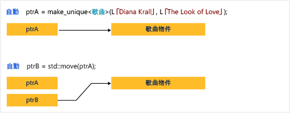

# 如何：建立和使用 unique_ptr 執行個體
[!INCLUDE[vs2017banner](../assembler/inline/includes/vs2017banner.md)]

[unique\_ptr](../standard-library/unique-ptr-class.md) 不共用其指標。  這無法複製到另一個 `unique_ptr`、不能以傳值方式傳遞給函式，也無法用於任何需要製作複本的標準範本庫 \(STL\) 演算法。  只能移動 `unique_ptr`。  這表示記憶體資源的擁有權轉移到另一個 `unique_ptr`，原始 `unique_ptr` 不再擁有它。  因為多重擁有權會增加程序邏輯的複雜度，建議您將物件限制為一個擁有者。  因此，當您需要一般 C\+\+ 物件的智慧型指標時，請使用 `unique_ptr`，並在建構 `unique_ptr` 時，使用 [make\_unique](../Topic/make_unique.md) 協助程式函式。  
  
 下圖說明兩個 `unique_ptr` 執行個體之間的擁有權轉移。  
  
   
  
 `unique_ptr` 是定義在 STL 的 `<memory>` 標頭中。  這完全像原始指標一樣有效率，而且可以用於 STL 容器。  將 `unique_ptr` 執行個體加入至 STL 容器是有效率的作法，因為 `unique_ptr` 的移動建構函式不需要複製作業。  
  
## 範例  
 下列範例示範如何建立 `unique_ptr` 執行個體，並在函式之間傳遞這些執行個體。  
  
 [!code-cpp[stl_smart_pointers#210](../cpp/codesnippet/CPP/how-to-create-and-use-unique-ptr-instances_1.cpp)]  
  
 這些範例示範 `unique_ptr` 的這種基本特性：可加以移動，但無法複製。「移動」會將擁有權轉移到新的 `unique_ptr` 並重設舊的 `unique_ptr`。  
  
## 範例  
 下列範例示範如何建立 `unique_ptr` 執行個體並在向量中使用這些執行個體。  
  
 [!code-cpp[stl_smart_pointers#211](../cpp/codesnippet/CPP/how-to-create-and-use-unique-ptr-instances_2.cpp)]  
  
 在範圍 for 迴圈中，請注意 `unique_ptr` 是以傳址方式傳遞。  如果您嘗試在這裡以傳值方式傳遞，編譯器就會擲回錯誤，因為 `unique_ptr` 複製建構函式已刪除。  
  
## 範例  
 下列範例示範如何初始化本身為類別成員的 `unique_ptr`。  
  
 [!code-cpp[stl_smart_pointers#212](../cpp/codesnippet/CPP/how-to-create-and-use-unique-ptr-instances_3.cpp)]  
  
## 範例  
 您可以使用 [make\_unique](../Topic/make_unique.md) 建立陣列的 `unique_ptr`，但是無法使用 `make_unique` 初始化陣列元素。  
  
 [!code-cpp[stl_smart_pointers#213](../cpp/codesnippet/CPP/how-to-create-and-use-unique-ptr-instances_4.cpp)]  
  
 如需更多範例，請參閱 [make\_unique](../Topic/make_unique.md)。  
  
## 請參閱  
 [智慧型指標](../cpp/smart-pointers-modern-cpp.md)   
 [make\_unique](../Topic/make_unique.md)