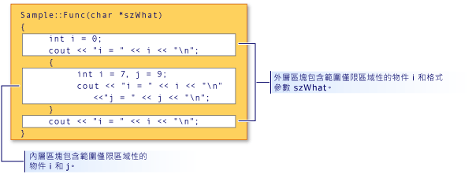

# <a name="scope-c"></a>範圍 (C++)

當您宣告的程式項目，例如類別、 函式或變數時，其名稱只能 「 看到 」 和程式的某些部分中使用。 會顯示名稱的內容會呼叫其*範圍*。 例如，如果您宣告變數`x`函式中`x`才會顯示該函式主體內。 它有*本機領域*。 您可能有其他變數相同名稱在您的程式;只要它們位於不同的範圍時，不會違反 「 一個定義規則，並不會引發錯誤。

針對自動的非靜態變數，範圍也會決定當應用程式建立和終結程式記憶體中。 

有六種範圍：

- **全域範圍**通用的名稱是其中之外任何類別、 函式或命名空間宣告。 不過，c + + 中甚至這些名稱有隱含的全域命名空間。 全域名稱的範圍延伸從宣告點至宣告它們的檔案結尾。 如需全域名稱，可見性也受到的規則[連結](program-and-linkage-cpp.md)決定名稱是否顯示在程式中的其他檔案中。

- **命名空間範圍**內宣告的名稱[命名空間](namespaces-cpp.md)、 任何類別或列舉的定義或函式區塊外部是可見從宣告點至命名空間的結尾。 命名空間可能定義在多個區塊，跨不同的檔案。

- **區域範圍**lambda，包括參數名稱或函式內宣告的名稱具有區域範圍。 它們通常稱為 「 區域變數 」。 它們才看得見從宣告點函式或 lambda 主體的結尾。 區域範圍是一種區塊範圍內，將在本文稍後討論。

- **類別範圍**類別成員的名稱具有類別範圍內，將整個類別定義，無論宣告點延伸。 類別成員存取範圍是由控制的進一步**公開**，**私人**，並**保護**關鍵字。 公用或受保護的成員可以存取只能藉由使用成員選取運算子 (**。** 或是**->**) 或成員指標運算子 (**。\*** 或是**-> \***)。

- **陳述式範圍**中所宣告的名稱**for**，**如果**，**雖然**，或**切換**陳述式會顯示，直到結束為止陳述式區塊。

- **函式範圍**A[標籤](labeled-statements.md)具有函式範圍，這表示它會顯示整個函式主體，甚至是之前宣告點。 函式範圍會讓您能夠撰寫陳述式例如`goto cleanup`之前`cleanup`標籤宣告。

## <a name="hiding-names"></a>隱藏名稱

您可以在封閉的區塊中宣告名稱，以隱藏該名稱。 下圖是在內層區塊中重新宣告 `i`，從而隱藏外層區塊範圍中與 `i` 相關的變數。

 區塊範圍和名稱隱藏

 本圖所示的程式輸出為：

```cpp
i = 0
i = 7
j = 9
i = 0
```

> [!NOTE]
> `szWhat` 引數被視為在函式的範圍中。 因此，其會被視為已在函式的最外層區塊中宣告。

## <a name="hiding-class-names"></a>隱藏類別名稱

 您可以藉由宣告函式、物件、變數或相同範圍中的列舉程式，隱藏類別名稱。 不過，類別名稱仍可存取時加上關鍵字**類別**。

```cpp
// hiding_class_names.cpp
// compile with: /EHsc
#include <iostream>
using namespace std;

// Declare class Account at global scope.
class Account
{
public:
    Account( double InitialBalance )
        { balance = InitialBalance; }
    double GetBalance()
        { return balance; }
private:
    double balance;
};

double Account = 15.37;            // Hides class name Account

int main()
{
    class Account Checking( Account ); // Qualifies Account as 
                                       //  class name

    cout << "Opening account with balance of: "
         << Checking.GetBalance() << "\n";
}
//Output: Opening account with balance of: 15.37
```

> [!NOTE]
> 任何將放在類別名稱 (`Account`) 稱為的關鍵字類別必須用來區分它與全域範圍的變數 Account。 當類別名稱出現在範圍解析運算子 (::) 的左邊時，不適用這項規則。 範圍解析運算子左邊的名稱一律視為類別名稱。

 下列範例示範如何宣告型別的物件的指標`Account`使用**類別**關鍵字：

```cpp
class Account *Checking = new class Account( Account );
```

 `Account`初始設定式中 （在括弧內） 在上述陳述式中具有全域範圍; 它是型別**double**。

> [!NOTE]
> 重複使用識別項名稱 (如這個範例中所示) 會視為不良的程式設計風格。

 如需指標的詳細資訊，請參閱[衍生的型別](http://msdn.microsoft.com/aa14183c-02fe-4d81-95fe-beddb0c01c7c)。 如需宣告和初始化類別物件的資訊，請參閱[類別、 結構和等位](../cpp/classes-and-structs-cpp.md)。 如需有關使用資訊**新**並**刪除**可用存放區運算子，請參閱[新和 delete 運算子](new-and-delete-operators.md)。

## <a name="hiding-names-with-global-scope"></a>隱藏具有全域領域的名稱

 您可以藉由明確地宣告區塊範圍中的相同名稱，隱藏具有全域領域的名稱。 不過，全域領域名稱可以使用存取範圍解析運算子 (`::`)。

```cpp
#include <iostream>

int i = 7;   // i has global scope, outside all blocks
using namespace std;

int main( int argc, char *argv[] ) {
   int i = 5;   // i has block scope, hides i at global scope
   cout << "Block-scoped i has the value: " << i << "\n";
   cout << "Global-scoped i has the value: " << ::i << "\n";
}
```

```Output
Block-scoped i has the value: 5
Global-scoped i has the value: 7
```

## <a name="see-also"></a>另請參閱
 [基本概念](../cpp/basic-concepts-cpp.md)