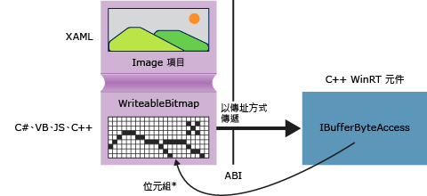

# <a name="obtaining-pointers-to-data-buffers-ccx"></a>取得資料緩衝區的指標 (C++/CX)

在 Windows 執行階段中， [Windows::Storage::Streams::IBuffer](/uwp/api/windows.storage.streams.ibuffer) 介面提供以語言中性、資料流的方式存取資料緩衝區。 在 C++ 中，可以透過定義在 robuffer.h 中的 Windows 執行階段程式庫 IBufferByteAccess 介面，取得基礎位元組陣列的原始指標。 使用這種方法，可以就地修改位元組陣列，而不建立任何不必要的資料複本。

下圖顯示 XAML 影像項目，其來源為 [Windows::UI::Xaml::Media::Imaging WriteableBitmap](/uwp/api/Windows.UI.Xaml.Media.Imaging.WriteableBitmap)。 以任何語言撰寫的用戶端應用程式可以將 `WriteableBitmap` 的參考傳遞至 C++ 程式碼，然後 C++ 可以使用該參考到達基礎緩衝區。 在通用 Windows 平台應用程式中撰寫的C++，您可以在下列範例中的原始程式碼中直接使用函式，而不將它包裝在 Windows 執行階段元件中。



## <a name="getpointertopixeldata"></a>GetPointerToPixelData

下列方法會接受 [Windows::Storage::Streams::IBuffer](/uwp/api/windows.storage.streams.ibuffer) ，並傳回基礎位元組陣列的原始指標。 若要呼叫函式，請傳入 [WriteableBitmap::PixelBuffer](/uwp/api/windows.ui.xaml.media.imaging.writeablebitmap.pixelbuffer) 屬性。

```cpp
#include <wrl.h>
#include <robuffer.h>
using namespace Windows::Storage::Streams;
using namespace Microsoft::WRL;
typedef uint8 byte;
// Retrieves the raw pixel data from the provided IBuffer object.
// Warning: The lifetime of the returned buffer is controlled by
// the lifetime of the buffer object that's passed to this method.
// When the buffer has been released, the pointer becomes invalid
// and must not be used.
byte* Class1::GetPointerToPixelData(IBuffer^ pixelBuffer, unsigned int *length)
{
    if (length != nullptr)
    {
        *length = pixelBuffer ->Length;
    }
    // Query the IBufferByteAccess interface.
    ComPtr<IBufferByteAccess> bufferByteAccess;
    reinterpret_cast<IInspectable*>( pixelBuffer)->QueryInterface(IID_PPV_ARGS(&bufferByteAccess));

    // Retrieve the buffer data.
    byte* pixels = nullptr;
    bufferByteAccess->Buffer(&pixels);
    return pixels;
}
```

## <a name="complete-example"></a>完整範例

下列步驟示範如何建立C#通用 Windows 平台應用程式傳遞`WriteableBitmap`到C++Windows 執行階段元件 DLL。 C++ 程式碼取得像素緩衝區的指標，並且在影像上執行簡單的就地修改。 或者，您可以使用 Visual Basic、JavaScript 或 C++ 而不使用 C#，建立用戶端應用程式 如果您使用 C++，則不需要元件 DLL，可以將這些方法直接加入至 MainPage 類別或您定義的其他類別。

#### <a name="create-the-client"></a>建立用戶端

1. 使用 空白應用程式專案範本建立 C# 通用 Windows 平台應用程式。

1. 在 MainPage.xaml 中

   - 使用這個 XAML 取代 `Grid` 項目：

        ```xml
        <Grid Background="{StaticResource ApplicationPageBackgroundThemeBrush}">
            <StackPanel HorizontalAlignment="Left" Margin="176,110,0,0" VerticalAlignment="Top" Width="932">
                <Image x:Name="Pic"/>
                <Button Content="Process Image" HorizontalAlignment="Stretch" VerticalAlignment="Stretch" Height="47" Click="Button_Click_1"/>
            </StackPanel>
        </Grid>
        ```

1. 在 MainPage.xaml.cs 中

   1. 加入下列命名空間宣告：

        ```csharp
        using Windows.Storage;
        using Windows.Storage.FileProperties;
        using Windows.UI.Xaml.Media.Imaging;
        using Windows.Storage.Streams;
        using Windows.Storage.Pickers;
        ```

   1. 將 `WriteableBitmap` 成員變數加入至 `MainPage` 類別並將它命名為 `m_bm`。

        ```csharp
        private WriteableBitmap m_bm;
        ```

   1. 使用下列程式碼取代 `OnNavigatedTo` 方法 Stub。 當應用程式啟動時，會開啟檔案選擇器 (請注意， `async` 關鍵字加入至函式簽章)。

        ```csharp
        async protected override void OnNavigatedTo(NavigationEventArgs e)
        {
            FileOpenPicker openPicker = new FileOpenPicker();
            openPicker.ViewMode = PickerViewMode.Thumbnail;
            openPicker.SuggestedStartLocation = PickerLocationId.PicturesLibrary;
            openPicker.FileTypeFilter.Add(".jpg");
            openPicker.FileTypeFilter.Add(".jpeg");
            openPicker.FileTypeFilter.Add(".png");

            StorageFile file = await openPicker.PickSingleFileAsync();
            if (file != null)
            {
                // Get the size of the image for the WriteableBitmap constructor.
                ImageProperties props = await file.Properties.GetImagePropertiesAsync();
                m_bm = new WriteableBitmap((int)props.Height, (int)props.Width);
                m_bm.SetSource(await file.OpenReadAsync());
                Pic.Source = m_bm;
            }
            else
            {
                //  Handle error...
            }
        }
        ```

   1. 加入按一下按鈕事件的事件處理常式 (由於 `ImageManipCPP` 命名空間參考尚未建立，在編輯器視窗中它可能會有波浪底線)。

        ```csharp
        async private void Button_Click_1(object sender, RoutedEventArgs e)
        {
            ImageManipCPP.Class1 obj = new ImageManipCPP.Class1();
            await obj.Negativize(m_bm);
            Pic.Source = m_bm;
        }
        ```

#### <a name="create-the-c-component"></a>建立 C++ 元件

1. 新增C++Windows 執行階段元件加入現有的方案，並將它命名`ImageManipCPP`。 C# 專案中加入它的參考，以滑鼠右鍵按一下該專案中**方案總管**，然後選擇**新增**，**參考**。

1. 在 Class1.h 中

   1. 在第二行， `typedef` 之後，加入這個 `#pragma once`：

        ```cpp
        typedef uint8 byte;
        ```

   1. 在 `WebHostHidden` 宣告的開頭上方，加入 `Class1` 屬性。

        ```cpp
        [Windows::Foundation::Metadata::WebHostHidden]
        ```

   1. 將這個公用方法簽章加入至 `Class1`：

        ```cpp
        Windows::Foundation::IAsyncAction^ Negativize(Windows::UI::Xaml::Media::Imaging::WriteableBitmap^ bm);
        ```

   1. 從先前程式碼片段顯示的 `GetPointerToPixelData` 方法，加入簽章。 請確定這個方法是私用的。

1. 在 Class1.cpp 中

   1. 加入這些 `#include` 指示詞和命名空間宣告：

        ```cpp
        #include <ppltasks.h>
        #include <wrl.h>
        #include <robuffer.h>

        using namespace Windows::Storage;
        using namespace Windows::UI::Xaml::Media::Imaging;
        using namespace Windows::Storage::Streams;
        using namespace Microsoft::WRL;
        ```

   1. 從先前的程式碼片段，加入 `GetPointerToPixelData` 的實作。

   1. 加入 `Negativize`的實作。 這個方法會透過反轉像素的每個 RGB 值，建立類似於負片的效果。 因為在較大的影像上可能需要有感時間才能完成作業，我們將方法設為非同步。

        ```cpp
        IAsyncAction^ Class1::Negativize(WriteableBitmap^ bm)
        {
            unsigned int length;
            byte* sourcePixels = GetPointerToPixelData(bm->PixelBuffer, &length);
            const unsigned int width = bm->PixelWidth;
            const unsigned int height = bm->PixelHeight;

            return create_async([this, width, height, sourcePixels]
            {
                byte* temp = sourcePixels;
                for(unsigned int k = 0; k < height; k++)
                {
                    for (unsigned int i = 0; i < (width * 4); i += 4)
                    {
                        int pos = k * (width * 4) + (i);
                        temp[pos] = ~temp[pos];
                        temp[pos + 1] = ~temp[pos + 1] / 3;
                        temp[pos + 2] = ~temp[pos + 2] / 2;
                        temp[pos + 3] = ~temp[pos + 3];
                    }
                }
            });

        }
        ```

      > [!NOTE]
      > 如果您使用 AMP 或平行模式程式庫來平行化作業，這個方法可能會更快速執行。

1. 確定您的圖片資料夾中至少有一個圖片，然後按 F5 編譯和執行程式。
