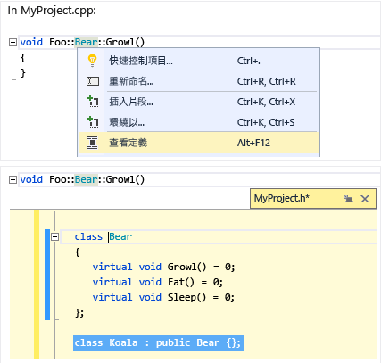
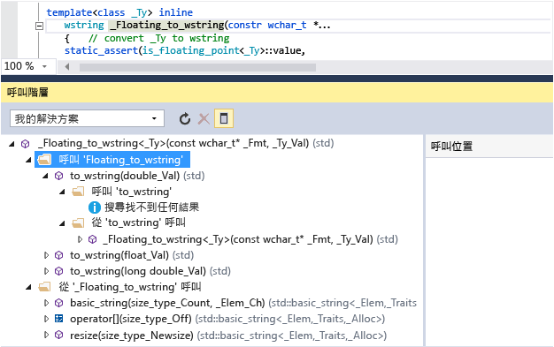
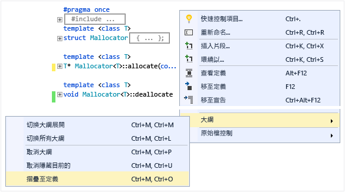

# 撰寫及重構程式碼 (C++)

Visual C++ 程式碼編輯器和 IDE 提供許多程式碼撰寫的輔助工具。 有些是 C++ 獨有，有些則基本上對所有 Visual Studio 語言都相同。 如需編輯器的詳細資訊，請參閱[在程式碼和文字編輯器中撰寫程式碼](/visualstudio/ide/writing-code-in-the-code-and-text-editor)。 啟用及設定 C++- 特定功能的選項位於 [工具] &#124; [選項] &#124; [文字編輯器] &#124; [C/C++] 下。 選擇您想要設定的選項之後，您可以在對話方塊成為焦點時按下 **F1** 來取得更多說明。 對於一般程式碼格式化選項，請將 `Editor C++` 鍵入至**快速啟動**。

您可以在[文字編輯器 C++ 實驗](/visualstudio/ide/reference/options-text-editor-c-cpp-experimental)對話方塊中找到不一定包含在 Visual Studio 未來版本中的實驗性功能。 在 Visual Studio 2017 中，您可以啟用這個對話方塊中的 [預測性 IntelliSense]。

## 新增檔案

若要將檔案新增至專案，請以滑鼠右鍵按一下 [方案總管] 中的專案節點，並選擇 [新增] &#124; [新增]。

## 格式化選項

若要設定格式化選項，例如縮排、以大括弧完成和顏色標示，請將 "C++ Formatting" 鍵入至 [快速啟動] 視窗。 Visual Studio 2017 15.7 版和更新版本支援 ClangFormat。 您可以在 [C/C++ 格式化屬性頁](/visualstudio/ide/reference/options-text-editor-c-cpp-formatting)的 [工具] &#124; [選項] &#124; [文字編輯器] &#124; [C/C++] &#124; [格式化] 下設定它。

## IntelliSense

IntelliSense 是一組功能的名稱，提供有關成員、類型和函式多載的內嵌資訊。 下圖顯示您在輸入時會出現的下拉式成員清單。 您可以按下 [tab] 鍵，將選取的項目文字輸入到您的程式碼檔案。

如需完整資訊，請參閱 [Visual C++ IntelliSense](/visualstudio/ide/visual-cpp-intellisense)。

## 插入程式碼片段

程式碼片段是預先定義的原始碼片段。 以滑鼠右鍵按一下單點或選取的文字，可插入程式碼片段或以程式碼片段圍繞選取的文字。 下圖顯示以 for 迴圈圍繞所選陳述式的三個步驟。 最終影像中的黃色反白顯示就是您使用 tab 鍵存取的可編輯欄位。 如需詳細資訊，請參閱[程式碼片段](/visualstudio/ide/code-snippets)。

## 加入類別

使用 [類別精靈] 從 [專案] 功能新增類別。

![Visual C&#43;&#43; 中的 [新增類別]](../ide/media/vs2015_cpp_add_class.png "vs2015_cpp_add_class")

您也可以使用 [類別精靈] 來修改或檢查現有的類別。

如需詳細資訊，請參閱[使用程式碼精靈新增功能 (C++)](../ide/adding-functionality-with-code-wizards-cpp.md)。

## 重構

重構可以從 [快速動作] 操作功能表下取得，或是按一下編輯器中的[燈泡](/visualstudio/ide/perform-quick-actions-with-light-bulbs)。  在 [編輯] > [重構] 功能表中也可以找到部分項目。  這些功能包括：

* [重新命名](refactoring/rename.md)
* [擷取函式](refactoring/extract-function.md)
* [實作純虛擬函式](refactoring/implement-pure-virtuals.md)
* [建立宣告/定義](refactoring/create-declaration-definition.md)
* [移動函式定義](refactoring/move-definition-location.md)
* [轉換為原始字串常值](refactoring/convert-to-raw-string-literal.md)
* [變更簽章](refactoring/change-signature.md)

## 巡覽和了解

Visual C++ 與其他語言共用許多程式碼巡覽功能。 如需詳細資訊，請參閱[巡覽程式碼](/visualstudio/ide/navigating-code)和[檢視程式碼的結構](/visualstudio/ide/viewing-the-structure-of-code)。

## QuickInfo

將滑鼠暫留在變數上，可檢視其類型資訊。

## 開啟文件 (巡覽至標頭)

在 `#include` 指示詞中的標頭名稱上按一下滑鼠右鍵，並開啟標頭檔。

![Visual C&#43;&#43; [開啟文件] 功能表選項](../ide/media/vs2015_cpp_open_document.png "vs2015_cpp_open_document")

## 查看定義

將滑鼠暫留在變數或函式宣告上，按一下滑鼠右鍵，然後選擇 [查看定義]，以查看其定義的內嵌檢視。 如需詳細資訊，請參閱[查看定義 (Alt+F12)](/visualstudio/ide/how-to-view-and-edit-code-by-using-peek-definition-alt-plus-f12)。

## 移至定義

將滑鼠暫留在變數或函式宣告上，按一下滑鼠右鍵，然後選擇 [移至定義]，以開啟在其中定義物件的文件。

## 檢視呼叫階層

以滑鼠右鍵按一下任何函式呼叫，並檢視它呼叫的所有函式 (以及呼叫它的所有函式) 之遞迴清單。 清單中的每個函式都可以用相同方式展開。 如需詳細資訊，請參閱[呼叫階層](/visualstudio/ide/reference/call-hierarchy)。

## 切換標頭/程式碼檔

按一下滑鼠右鍵，然後選擇 [切換標頭 / 程式碼檔案]，在標頭檔與其相關聯的程式碼檔案之間來回切換。

## 大綱

在原始程式碼檔案中的任何位置按一下滑鼠右鍵，然後選擇 [大綱] 可摺疊或展開定義及/或自訂區域，讓您更方便僅瀏覽感興趣的部分。 如需詳細資訊，請參閱[大綱](/visualstudio/ide/outlining)。

## 捲軸對應模式

捲軸對應模式可讓您快速地捲動及瀏覽程式碼檔案，而不需要實際離開目前位置。 或按一下 Code Map 上的任何位置，直接移至該處。 如需詳細資訊，請參閱[如何：自訂捲軸以追蹤程式碼](/visualstudio/ide/how-to-track-your-code-by-customizing-the-scrollbar)。

## 產生 Include 檔圖形

以滑鼠右鍵按一下專案中的程式碼檔案，然後選擇 [產生 Include 檔圖形]，以查看其他檔案所包含之檔案的圖形。

## F1 說明

將游標放在任何類型、關鍵字或函式之處或之後，然後按 [F1] 鍵即可直接移至 docs.microsoft.com 上的相關參考主題。 F1 鍵也適用於錯誤清單中及許多對話方塊中的項目。

## 快速啟動

若要輕鬆地巡覽至 Visual Studio 中的任何視窗或工具，只要在 UI 右上角的 [快速啟動] 視窗中輸入其名稱即可。 當您輸入時，就會篩選自動完成清單。

