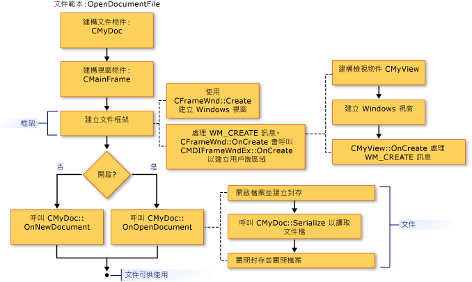

# 建立新文件、視窗和檢視
[!INCLUDE[vs2017banner](../assembler/inline/includes/vs2017banner.md)]

下圖提供文件、檢視和框架視窗的建立程序概觀。  將焦點放在參數與物件的其他文件提供詳細資料。  
  
 在完成此程序之後，小組的物件彼此存在並儲存指標。  下圖顯示物件建立的序列。  您可以遵循序列圖表加入至圖表。  
  
   
建立文件的順序  
  
   
在建立框架視窗的序列  
  
   
建立檢視的順序  
  
 如需架構如何初始化新的文件、檢視和框架視窗物件，請參閱《MFC 程式庫參考的類別 [CDocument](../mfc/reference/cdocument-class.md)、 [CView](../mfc/reference/cview-class.md)、 [CFrameWnd](../mfc/reference/cframewnd-class.md)、 [CMDIFrameWnd](../mfc/reference/cmdiframewnd-class.md)和 [CMDIChildWnd](../mfc/reference/cmdichildwnd-class.md) 。  請參閱 [Technical Note 22](../mfc/tn022-standard-commands-implementation.md)，說明建立和初始化程序進一步在 **檔案**  選單下的`New`和**開啟** 項目相關的框架的標準檔案功能表上的命令和開啟項目的其討論下。  
  
##   初始化您加入至這些類別  
 上述圖也建議您可以覆寫成員函式初始化應用程式之物件的點。  `OnInitialUpdate` 覆寫在檢視類別的是初始化檢視的最佳位置。  呼叫 `OnInitialUpdate` 時發生，它會在框架視窗建立之後，並在框架視窗內檢視附加至其資料。  例如，在中，如果您的意圖是捲動檢視 \(衍生自 `CScrollView` 而非 `CView`\)，您應該將根據您的 `OnInitialUpdate` 覆寫的檔案大小的檢視大小。\(此處理序會在 [CScrollView](../mfc/reference/cscrollview-class.md)類別的描述中說明\)。您可以覆寫 **CDocument** 成員函式 `OnNewDocument` 和 `OnOpenDocument` 提供文件的應用程式特定的初始化。  通常，因為資料可以用兩種方式，您必須覆寫兩個。  
  
 在大部分情況下，您的覆寫應該呼叫基底類別版本。  如需詳細資訊，請參閱類別 [CDocument](../mfc/reference/cdocument-class.md)、 [CView](../mfc/reference/cview-class.md)、 [CFrameWnd](../mfc/reference/cframewnd-class.md)和 [CWinApp](../mfc/reference/cwinapp-class.md) 的具名成員函式在 MFC 程式庫參考的。  
  
## 請參閱  
 [文件範本和文件\/檢視建立流程](../mfc/document-templates-and-the-document-view-creation-process.md)   
 [文件樣板建立](../mfc/document-template-creation.md)   
 [文件\/檢視建立](../mfc/document-view-creation.md)   
 [MFC 物件關聯性](../mfc/relationships-among-mfc-objects.md)