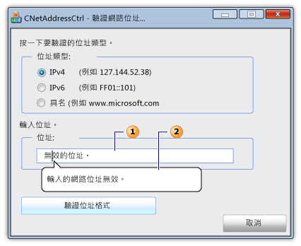

# <a name="cnetaddressctrl-class"></a>CNetAddressCtrl 類別

`CNetAddressCtrl` 類別表示網路位址控制項，您可以用來輸入和驗證 IPv4、IPv6 和具名 DNS 位址的格式。

## <a name="syntax"></a>語法

```
class CNetAddressCtrl : public CEdit
```

## <a name="members"></a>成員

### <a name="public-constructors"></a>公用建構函式

|名稱|描述|
|----------|-----------------|
|[CNetAddressCtrl::CNetAddressCtrl](#cnetaddressctrl)|建構 `CNetAddressCtrl` 物件。|

### <a name="public-methods"></a>公用方法

|名稱|描述|
|----------|-----------------|
|[CNetAddressCtrl::Create](#create)|使用指定的樣式建立的網路位址控制項，並將它附加至目前`CNetAddressCtrl`物件。|
|[CNetAddressCtrl::CreateEx](#createex)|使用指定的延伸樣式建立的網路位址控制項，並將它附加至目前`CNetAddressCtrl`物件。|
|[CNetAddressCtrl::DisplayErrorTip](#displayerrortip)|當使用者在輸入中目前的網路位址控制項不支援的網路位址時，會顯示錯誤汽球提示。|
|[CNetAddressCtrl::GetAddress](#getaddress)|擷取目前的網路位址控制項相關聯的網路位址的驗證和剖析表示法。|
|[CNetAddressCtrl::GetAllowType](#getallowtype)|擷取目前的網路位址控制項可支援的網路位址類型。|
|[CNetAddressCtrl::SetAllowType](#setallowtype)|設定目前的網路位址控制項可支援的網路位址的類型。|

## <a name="remarks"></a>備註

網路位址控制項驗證使用者輸入的地址的格式不正確。 控制項不會實際連線到網路位址。 [CNetAddressCtrl::SetAllowType](#setallowtype)方法會指定一或多個類型的地址所[CNetAddressCtrl::GetAddress](#getaddress)方法可以剖析和驗證。 位址可以是 IPv4，IPv6 或具名的伺服器、 網路、 主機或廣播的訊息目的地的地址的格式。 如果位址的格式不正確，您可以使用[CNetAddressCtrl::DisplayErrorTip](#displayerrortip)來顯示資訊提示訊息方塊，以圖形方式指出網路位址控制項的文字方塊中，而且會顯示一個預先定義的方法錯誤訊息。

`CNetAddressCtrl`類別衍生自[CEdit](../../mfc/reference/cedit-class.md)類別。 因此，網路位址控制項提供存取所有的 Windows 編輯控制項訊息。

下圖將說明包含網路位址控制項的對話方塊。 文字 方塊中 （1） 的網路位址控制項包含無效的網路位址。 網路位址是否無效，會顯示資訊提示訊息 (2)。



## <a name="example"></a>範例

下列程式碼範例是一個對話方塊，驗證網路位址的一部分。 三個選項按鈕的事件處理常式指定的網路位址可以是其中一種位址類型。 使用者在網路控制中，文字方塊中輸入的地址，然後按下按鈕，以驗證地址。 如果位址是有效的則會顯示成功訊息;否則，會顯示預先定義的資訊提示錯誤訊息。

[!code-cpp[NVC_MFC_CNetAddressCtrl_s1#1](../../mfc/reference/codesnippet/cpp/cnetaddressctrl-class_1.cpp)]

## <a name="example"></a>範例

下列程式碼範例從對話方塊標頭檔會定義[NC_ADDRESS](/windows/desktop/api/shellapi/ns-shellapi-tagnc_address)並[NET_ADDRESS_INFO](/windows/desktop/shell/hkey-type)變數所需的[CNetAddressCtrl::GetAddress](#getaddress)方法。

[!code-cpp[NVC_MFC_CNetAddressCtrl_s1#2](../../mfc/reference/codesnippet/cpp/cnetaddressctrl-class_2.h)]

## <a name="inheritance-hierarchy"></a>繼承階層

[CObject](../../mfc/reference/cobject-class.md)

[CCmdTarget](../../mfc/reference/ccmdtarget-class.md)

[CWnd](../../mfc/reference/cwnd-class.md)

[CEdit](../../mfc/reference/cedit-class.md)

`CNetAddressCtrl`

## <a name="requirements"></a>需求

**標頭：** afxcmn.h

這個類別支援在 Windows Vista 和更新版本。

這個類別的其他需求所述[建置需求的 Windows Vista 通用控制項](../../mfc/build-requirements-for-windows-vista-common-controls.md)。

##  <a name="cnetaddressctrl"></a>  CNetAddressCtrl::CNetAddressCtrl

建構 `CNetAddressCtrl` 物件。

```
CNetAddressCtrl();
```

### <a name="remarks"></a>備註

使用[CNetAddressCtrl::Create](#create)或是[CNetAddressCtrl::CreateEx](#createex)方法來建立網路控制，並將其附加至`CNetAddressCtrl`物件。

##  <a name="create"></a>  CNetAddressCtrl::Create

使用指定的樣式建立的網路位址控制項，並將它附加至目前`CNetAddressCtrl`物件。

```
virtual BOOL Create(
    DWORD dwStyle,
    const RECT& rect,
    CWnd* pParentWnd,
    UINT nID);
```

### <a name="parameters"></a>參數

|參數|描述|
|---------------|-----------------|
|*dwStyle*|[in]若要套用至控制項的樣式的位元組合。 如需詳細資訊，請參閱 <<c0> [ 編輯樣式](../../mfc/reference/styles-used-by-mfc.md#edit-styles)。|
|*rect*|[in]參考[RECT](/previous-versions/dd162897\(v=vs.85\))結構，包含控制項的大小與位置。|
|*pParentWnd*|[in]非 null 指標[CWnd](../../mfc/reference/cwnd-class.md)是控制項的父視窗的物件。|
|*nID*|[in]控制項的 ID。|

### <a name="return-value"></a>傳回值

如果成功，這個方法，則為 TRUE。否則為 FALSE。

##  <a name="createex"></a>  CNetAddressCtrl::CreateEx

使用指定的延伸樣式建立的網路位址控制項，並將它附加至目前`CNetAddressCtrl`物件。

```
virtual BOOL CreateEx(
    DWORD dwExStyle,
    DWORD dwStyle,
    const RECT& rect,
    CWnd* pParentWnd,
    UINT nID);
```

### <a name="parameters"></a>參數

|參數|描述|
|---------------|-----------------|
|*dwExStyle*|[in]位元組合 (OR) 套用至控制項的延伸樣式。 如需詳細資訊，請參閱 < *dwExStyle*的參數[CreateWindowEx](/windows/desktop/api/winuser/nf-winuser-createwindowexa)函式。|
|*dwStyle*|[in]位元組合 (OR) 套用至控制項的樣式。 如需詳細資訊，請參閱 <<c0> [ 編輯樣式](../../mfc/reference/styles-used-by-mfc.md#edit-styles)。|
|*rect*|[in]參考[RECT](/previous-versions/dd162897\(v=vs.85\))結構，包含控制項的大小與位置。|
|*pParentWnd*|[in]非 null 指標[CWnd](../../mfc/reference/cwnd-class.md)是控制項的父視窗的物件。|
|*nID*|[in]控制項的 ID。|

### <a name="return-value"></a>傳回值

如果成功，這個方法，則為 TRUE。否則為 FALSE。

##  <a name="displayerrortip"></a>  CNetAddressCtrl::DisplayErrorTip

在目前的網路位址控制項相關聯之氣球提示中顯示錯誤訊息。

```
HRESULT DisplayErrorTip();
```

### <a name="return-value"></a>傳回值

值`S_OK`如果這個方法成功，反之則為錯誤碼。

### <a name="remarks"></a>備註

使用[CNetAddressCtrl::SetAllowType](#setallowtype)方法，以指定的位址可支援目前的網路位址控制項類型。 使用[CNetAddressCtrl::GetAddress](#getaddress)方法來驗證和剖析使用者輸入的網路位址。 使用[CNetAddressCtrl::DisplayErrorTip](#displayerrortip)方法時所顯示的錯誤訊息資訊提示[CNetAddressCtrl::GetAddress](#getaddress)方法不成功。

此訊息會叫用[NetAddr_DisplayErrorTip](/windows/desktop/api/shellapi/nf-shellapi-netaddr_displayerrortip)巨集，Windows SDK 中所述。 該巨集會傳送`NCM_DISPLAYERRORTIP`訊息。

##  <a name="getaddress"></a>  CNetAddressCtrl::GetAddress

擷取目前的網路位址控制項相關聯的網路位址的驗證和剖析表示法。

```
HRESULT GetAddress(PNC_ADDRESS pAddress) const;
```

### <a name="parameters"></a>參數

*pAddress*<br/>
[in、 out]指標[NC_ADDRESS](/windows/desktop/api/shellapi/ns-shellapi-tagnc_address)結構。  設定*pAddrInfo*屬於此結構的位址[NET_ADDRESS_INFO](/windows/desktop/shell/hkey-type)結構，然後再呼叫 GetAddress 方法。

### <a name="return-value"></a>傳回值

值為 S_OK，如果這個方法成功，否則，COM 錯誤碼。 如需可能的錯誤碼的詳細資訊，請參閱的傳回值區段[NetAddr_GetAddress](/windows/desktop/api/shellapi/nf-shellapi-netaddr_getaddress)巨集。

### <a name="remarks"></a>備註

如果這個方法成功， [NET_ADDRESS_INFO](/windows/desktop/shell/hkey-type)結構包含的網路位址的其他資訊。

使用[CNetAddressCtrl::SetAllowType](#setallowtype)方法，以指定的位址可支援目前的網路位址控制項類型。 使用[CNetAddressCtrl::GetAddress](#getaddress)方法來驗證和剖析使用者輸入的網路位址。 使用[CNetAddressCtrl::DisplayErrorTip](#displayerrortip)方法時所顯示的錯誤訊息資訊提示[CNetAddressCtrl::GetAddress](#getaddress)方法不成功。

這個方法會叫用[NetAddr_GetAddress](/windows/desktop/api/shellapi/nf-shellapi-netaddr_getaddress)巨集，Windows SDK 中所述。 該巨集會傳送 NCM_GETADDRESS 的訊息。

##  <a name="getallowtype"></a>  CNetAddressCtrl::GetAllowType

擷取目前的網路位址控制項可支援的網路位址類型。

```
DWORD GetAllowType() const;
```

### <a name="return-value"></a>傳回值

網路位址控制項可以支援的位元組合 (OR) 旗標，以指定的位址類型。 如需詳細資訊，請參閱 < [NET_STRING](/windows/desktop/shell/net-string)。

### <a name="remarks"></a>備註

此訊息會叫用[NetAddr_GetAllowType](/windows/desktop/api/shellapi/nf-shellapi-netaddr_getallowtype)巨集，Windows SDK 中所述。 該巨集會傳送 NCM_GETALLOWTYPE 的訊息。

##  <a name="setallowtype"></a>  CNetAddressCtrl::SetAllowType

設定目前的網路位址控制項可支援的網路位址的類型。

```
HRESULT SetAllowType(DWORD dwAddrMask);
```

### <a name="parameters"></a>參數

|參數|描述|
|---------------|-----------------|
|*dwAddrMask*|[in]網路位址控制項可以支援的位元組合 (OR) 旗標，以指定的位址類型。 如需詳細資訊，請參閱 < [NET_STRING](/windows/desktop/shell/net-string)。|

### <a name="return-value"></a>傳回值

如果這個方法會成功則為 S_OK否則，COM 錯誤碼。

### <a name="remarks"></a>備註

使用[CNetAddressCtrl::SetAllowType](#setallowtype)方法，以指定的位址可支援目前的網路位址控制項類型。 使用[CNetAddressCtrl::GetAddress](#getaddress)方法來驗證和剖析使用者輸入的網路位址。 使用[CNetAddressCtrl::DisplayErrorTip](#displayerrortip)方法時所顯示的錯誤訊息資訊提示[CNetAddressCtrl::GetAddress](#getaddress)方法不成功。

此訊息會叫用[NetAddr_SetAllowType](/windows/desktop/api/shellapi/nf-shellapi-netaddr_setallowtype)巨集，Windows SDK 中所述。 該巨集會傳送 NCM_SETALLOWTYPE 的訊息。

## <a name="see-also"></a>另請參閱

[CNetAddressCtrl 類別](../../mfc/reference/cnetaddressctrl-class.md)<br/>
[階層架構圖表](../../mfc/hierarchy-chart.md)<br/>
[CEdit 類別](../../mfc/reference/cedit-class.md)
