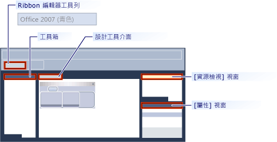

# <a name="ribbon-designer-mfc"></a>功能區設計工具 (MFC)

功能區設計工具可讓您建立和自訂 MFC 應用程式中的功能區。 功能區是可將命令組織成邏輯群組的使用者介面 (UI) 項目。 這些群組可出現在跨視窗頂端區域中的個別索引標籤上。 功能區取代了功能表列和工具列。 功能區可大幅改善應用程式可用性。 如需詳細資訊，請參閱 <<c0> [ 功能區](/windows/desktop/uxguide/cmd-ribbons)。 下圖顯示功能區。


在舊版的 Visual Studio 中，功能區必須撰寫程式碼，例如使用 MFC 功能區類別建立[CMFCRibbonBar 類別](../mfc/reference/cmfcribbonbar-class.md)。 在 Visual Studio 2010 和更新版本，則功能區設計工具會提供建置功能區的替代方法。 首先，建立及自訂功能區作為資源。 然後從 MFC 應用程式中的程式碼載入功能區資源。 您甚至可以一起使用功能區資源和 MFC 功能區類別。 例如，您可以建立功能區資源，並再以程式設計方式加入更多項目，在執行階段使用程式碼。

## <a name="understanding-the-ribbon-designer"></a>了解功能區設計工具

功能區設計工具會建立功能區並將其儲存為資源。 當您建立功能區資源時，功能區設計工具會執行下列三項動作：

- 新增專案資源定義指令碼 (*.rc) 中的項目。 在下列範例中，IDR_RIBBON 是識別功能區資源的唯一名稱、 RT_RIBBON_XML 是資源類型，而 ribbon.mfcribbon-ms ms 是資源檔的名稱。

```
    IDR_RIBBON RT_RIBBON_XML      "res\\ribbon.mfcribbon-ms"
```

- 將命令 ID 的定義新增至 resource.h。

```
#define IDR_RIBBON            307
```

- 建立功能區資源檔 (*.mfcribbon-ms)，其中包含定義功能區按鈕、控制項和屬性的 XML 程式碼。 功能區設計工具中的功能區變更會以 XML 格式儲存在資源檔中。 下列程式碼範例顯示的內容的一部分\*.mfcribbon-ms 檔：

```
<RIBBON_BAR>
<ELEMENT_NAME>RibbonBar</ELEMENT_NAME>
<IMAGE>
<ID>
<NAME>IDB_BUTTONS</NAME>
<VALUE>113</VALUE>
</ID>
```

若要在 MFC 應用程式中使用功能區資源，請藉由呼叫載入資源[cmfcribbonbar:: Loadfromresource](../mfc/reference/cmfcribbonbar-class.md#loadfromresource)。

## <a name="creating-a-ribbon-by-using-the-ribbon-designer"></a>使用功能區設計工具建立功能區

下列兩個方法可將功能區資源新增至您的 MFC 專案中：

- 建立 MFC 應用程式並設定 MFC 專案精靈以建立功能區。 如需詳細資訊，請參閱[逐步解說：使用 MFC 建立功能區應用程式](../mfc/walkthrough-creating-a-ribbon-application-by-using-mfc.md)。

- 在現有的 MFC 專案中，建立功能區資源並將其載入。 如需詳細資訊，請參閱[逐步解說：更新 MFC Scribble 應用程式 （第 1 部分）](../mfc/walkthrough-updating-the-mfc-scribble-application-part-1.md)。

如果您的專案已經以手動方式為功能區編碼，MFC 會具有函式，可用來將現有的功能區轉換為功能區資源。 如需詳細資訊，請參閱[如何：將現有的 MFC 功能區轉換為功能區資源](../mfc/how-to-convert-an-existing-mfc-ribbon-to-a-ribbon-resource.md)。

> [!NOTE]
>  在對話方塊架構應用程式中，無法建立功能區。 如需詳細資訊，請參閱 <<c0> [ 應用程式類型、 MFC 應用程式精靈](../mfc/reference/application-type-mfc-application-wizard.md)。

## <a name="customizing-ribbons"></a>自訂功能區

若要在功能區設計工具中開啟功能區，請按兩下資源檢視中的功能區資源。 在設計工具中，您可以新增、移除及自訂功能區、應用程式按鈕或快速存取工具列上的項目。 您也可以將事件 (例如按一下按鈕事件和功能表事件) 連結到應用程式中的方法。

下圖顯示功能區設計工具中的不同元件。



- **在 [工具箱]:** 包含可以拖曳至設計工具介面的控制項。

- **設計工具介面：** 包含功能區資源的視覺表示法。

- **屬性 視窗中：** 列出在設計工具介面上選取之項目的屬性。

- **資源檢視 視窗中：** 顯示專案中加入功能區資源的資源。

- **Ribbon 編輯器工具列：** 包含可讓您預覽功能區，並變更其視覺化佈景主題的命令。

下列主題描述如何在功能區設計工具中使用這些功能。

- [如何：自訂應用程式按鈕](../mfc/how-to-customize-the-application-button.md)

- [如何：自訂快速存取工具列](../mfc/how-to-customize-the-quick-access-toolbar.md)

- [如何：新增功能區控制項和事件處理常式](../mfc/how-to-add-ribbon-controls-and-event-handlers.md)

- [如何：從 MFC 應用程式載入功能區資源](../mfc/how-to-load-a-ribbon-resource-from-an-mfc-application.md)

## <a name="definitions-of-ribbon-elements"></a>功能區項目定義


- **應用程式按鈕：** 出現在功能區的左上角的按鈕。 應用程式按鈕會取代 [檔案] 功能表，而且即使功能區最小化時也會出現。 按一下按鈕時，會顯示具有命令列表的功能表。

- **快速存取工具列：** 小型、 可自訂的工具列，會顯示經常使用的命令。

- **類別目錄**:代表功能區索引標籤內容的邏輯群組。

- **分類預設按鈕：** 功能區最小化時，會出現在功能區按鈕。 按一下按鈕時，分類會以功能表的形式出現。

- **面板：** 會顯示相關的控制項群組的功能區列區域。 每個功能區分類包含一或多個功能區面板。

- **功能區項目：** 面板中的控制項，例如按鈕和下拉式方塊。 若要查看可以裝載各種控制項的功能區上，請參閱[RibbonGadgets 範例：功能區小工具應用程式](../overview/visual-cpp-samples.md)。

## <a name="see-also"></a>另請參閱

[使用者介面項目](../mfc/user-interface-elements-mfc.md)<br/>
[使用資源檔](../windows/working-with-resource-files.md)
