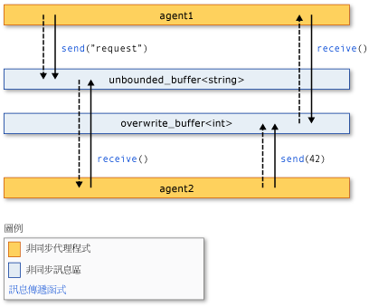

# 非同步代理程式程式庫
[!INCLUDE[vs2017banner](../../assembler/inline/includes/vs2017banner.md)]

非同步代理程式程式庫 (或簡稱 *代理程式程式庫*) 提供程式設計模型，可讓您增加啟用並行的應用程式開發的穩定性。 代理程式程式庫是 c + + 樣板程式庫可提升行動為基礎的程式設計模型和同處理序訊息傳遞進行粗略的資料流程與流水線操作工作。 代理程式程式庫為基礎的並行執行階段的排程及資源管理元件。  
  
## <a name="programming-model"></a>程式設計模型  
 代理程式程式庫提供共用狀態的替代方案，可讓您透過非同步通訊模型為基礎而不是控制流程的資料流程連接隔離的元件。 *資料流程* 指的是程式設計模型計算其中進行所有必要的資料時可以使用; *控制流程* 是指在預先定義的順序進行計算的程式設計模型。  
  
 資料流程程式設計模型與相關的概念 *訊息傳遞*, ，其中程式的獨立元件之間的通訊方式是傳送訊息。  
  
 代理程式程式庫由三個元件組成︰ *非同步代理程式*, ，*非同步訊息區*, ，和 *訊息傳遞功能*。 代理程式維護狀態，並使用訊息區和訊息傳遞函式來與彼此及外部元件進行通訊。 訊息傳遞函式可讓代理程式來傳送和接收訊息的外部元件。 非同步訊息區保留訊息，並啟用代理程式通訊以同步方式。  
  
 下圖顯示兩個代理程式使用訊息區和訊息傳遞函式來進行通訊。 在此圖中， `agent1` 傳送訊息給 `agent2` 使用 [concurrency:: send](../Topic/send%20Function.md) 函式和 [unbounded_buffer](../Topic/unbounded_buffer%20Class.md) 物件。 `agent2` 使用 [concurrency:: receive](../Topic/receive%20Function.md) 函式來讀取訊息。 `agent2` 會使用相同的方法來傳送訊息至 `agent1`。 虛線的箭頭表示代理程式之間的資料流程。 穩固的箭號會將它們寫入或讀取的訊息區塊連接代理程式。  
  
   
  
 實作此圖中的程式碼範例是本主題稍後所示。  
  
 代理程式的程式設計模型有其他並行處理和同步處理，例如事件機制，透過數個優點。 其中一個優點是，藉由使用訊息傳遞至傳輸物件之間的狀態變更，您可以找出共用的資源存取權，進而改善延展性。 訊息傳遞的優點是它繫結資料，而非將它繫結至外部同步處理物件的同步處理。 這可簡化元件之間的資料傳輸，並可以排除在您的應用程式的程式設計錯誤。  
  
## <a name="when-to-use-the-agents-library"></a>何時使用代理程式程式庫  
 當您有多項作業，必須以非同步方式與彼此通訊時，請使用代理程式庫。 訊息區塊與訊息傳遞功能可讓您撰寫平行應用程式，而不需要同步處理機制，例如鎖定。 這可讓您專注於應用程式邏輯。  
  
 代理程式的程式設計模型通常用來建立 *資料管線* 或 *網路*。 資料管線是一系列元件，其中每個執行特定工作，以便共同完成整體目標。 從另一個元件接收訊息時，每個資料流程管線元件會執行工作。 該工作的結果會傳遞至管線或網路中的其他元件。 元件可以使用更多更細緻的並行存取的功能與其他文件庫，例如， [平行模式程式庫 (PPL)](../../parallel/concrt/parallel-patterns-library-ppl.md)。  
  
## <a name="example"></a>範例  
 下列範例會實作本主題稍早所示的圖例。  
  
 [!code-cpp[concrt-basic-agents#1](../../parallel/concrt/codesnippet/CPP/asynchronous-agents-library_1.cpp)]  
  
 這個範例會產生下列輸出：  
  
```Output  
agent1: sending request...  
agent2: received 'request'.  
agent2: sending response...  
agent1: received '42'.  
```  
  
 下列主題說明此範例中使用的功能。  
  
## <a name="related-topics"></a>相關主題  
 [非同步代理程式](../../parallel/concrt/asynchronous-agents.md)  
 描述非同步代理程式的較大的運算工作的角色。  
  
 [非同步訊息區](../../parallel/concrt/asynchronous-message-blocks.md)  
 描述代理程式程式庫所提供的各種訊息區塊類型。  
  
 [訊息傳遞函式](../../parallel/concrt/message-passing-functions.md)  
 描述各種不同的訊息傳遞常式所提供的代理程式程式庫。  
  
 [How to︰ 實作各種生產者-消費者模式](../../parallel/concrt/how-to-implement-various-producer-consumer-patterns.md)  
 描述如何在您的應用程式中實作生產者-消費者模式。  
  
 [如何︰ 為呼叫和轉換程式類別提供工作函式](../../parallel/concrt/how-to-provide-work-functions-to-the-call-and-transformer-classes.md)  
 說明工作函式，以提供數種方式 [concurrency:: call](../../parallel/concrt/reference/call-class.md) 和 [concurrency:: transformer](../../parallel/concrt/reference/transformer-class.md) 類別。  
  
 [如何︰ 在資料管線中的使用轉換程式](../../parallel/concrt/how-to-use-transformer-in-a-data-pipeline.md)  
 示範如何使用 [concurrency:: transformer](../../parallel/concrt/reference/transformer-class.md) 資料管線中的類別。  
  
 [如何︰ 在已完成的工作之中選取](../../parallel/concrt/how-to-select-among-completed-tasks.md)  
 示範如何使用 [concurrency:: choice](../../parallel/concrt/reference/choice-class.md) 和 [concurrency:: join](../../parallel/concrt/reference/join-class.md) 類別選取第一項工作完成搜尋演算法。  
  
 [如何︰ 定期傳送訊息](../../parallel/concrt/how-to-send-a-message-at-a-regular-interval.md)  
 示範如何使用 [concurrency:: timer](../../parallel/concrt/reference/timer-class.md) 類別定期傳送訊息。  
  
 [如何︰ 使用訊息區篩選條件](../../parallel/concrt/how-to-use-a-message-block-filter.md)  
 示範如何使用篩選條件，讓非同步訊息區塊接受或拒絕的訊息。  
  
 [平行模式程式庫 (PPL)](../../parallel/concrt/parallel-patterns-library-ppl.md)  
 描述如何在您的應用程式中使用平行演算法，例如不同的平行模式。  
  
 [並行執行階段](../../parallel/concrt/concurrency-runtime.md)  
 說明並行執行階段，它可簡化平行程式設計，並包含相關主題的連結。

