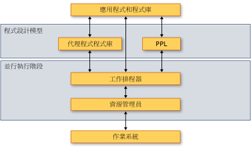

# 並行執行階段概觀
[!INCLUDE[vs2017banner](../../assembler/inline/includes/vs2017banner.md)]

本文件提供並行執行階段的總覽。  內容描述並行執行階段的優點、使用時機，以及其元件如何與彼此、與作業系統及應用程式互動。  
  
> [!IMPORTANT]
>  在 Visual Studio 2015 和更新版本中，並行執行階段工作排程器不再是 task 類別及 ppltasks.h 中相關類型適用的排程器。  那些類型現在使用 Windows 執行緒集區以獲得更佳的效能，以及與 Windows 同步處理原始物件的互通性。  平行演算法 \(例如 parallel\_for\) 會繼續使用並行執行階段工作排程器。  
  
##   章節  
 本文件包括下列章節：  
  
-   [並行執行階段之所以重要的原因](#runtime)  
  
-   [架構](#architecture)  
  
-   [C\+\+ Lambda 運算式](#lambda)  
  
-   [需求](#requirements)  
  
##   並行執行階段之所以重要的原因  
 並行執行階段為同時執行的應用程式與應用程式元件提供一致性和可預測性。  *「合作式工作排程」*\(cooperative task scheduling\) 和*「合作式封鎖」*\(cooperative blocking\) 便是兩個並行執行階段的優點例子。  
  
 並行執行階段會使用實作工作竊取演算法的合作式工作排程器，有效率地在運算資源之間分散工作。  例如，假設有個應用程式具有兩個執行緒，且都是由相同的執行階段管理。  如果一個執行緒完成其排定工作，它便可以從另一個執行緒卸載工作。  這項機制可在應用程式的整體工作負載之間取得平衡。  
  
 並行執行階段也會提供同步處理原始物件，使用合作式封鎖來同步處理對資源的存取。  例如，假設有一項工作必須具有對共用資源的獨佔存取權。  藉由合作方式封鎖，在第一項工作等候資源時，執行階段便可以使用剩餘的配量執行另一項工作。  這項機制會提升運算資源的最大使用量。  
  
 \[[靠上](#top)\]  
  
##   架構  
 並行執行階段分成四個元件：平行模式程式庫 \(PPL\)、非同步代理程式程式庫、工作排程器和資源管理員。  這些元件位於作業系統和應用程式之間。  下圖顯示並行執行階段元件在作業系統和應用程式之間互動的方式：  
  
 **並行執行階段架構**  
  
   
  
> [!IMPORTANT]
>  工作排程器和資源管理員元件無法從 [!INCLUDE[win8_appname_long](../../build/includes/win8_appname_long_md.md)] 應用程式取得，當您使用 task 類別或 ppltasks.h 中的其他類型時也無法使用。  
  
 並行執行階段高度*「可組合」*\(composable\)，也就是說，您可以結合現有的功能，以完成更多事項。  並行執行階段會組合來自較低層級元件的許多功能，例如平行演算法。  
  
 並行執行階段也會提供同步處理原始物件，使用合作式封鎖來同步處理對資源的存取。  如需這些同步處理原始物件的詳細資訊，請參閱[同步處理資料結構](../../parallel/concrt/synchronization-data-structures.md)。  
  
 下列各節提供每個元件所提供功能及其使用時機的簡短總覽。  
  
### 平行模式程式庫  
 平行模式程式庫 \(PPL\) 提供一般用途的容器和演算法來執行細部平行處理原則。  PPL 藉由提供平行演算法，將計算分散到運算資源之間的集合或資料集上，來達到*「命令式資料平行處理原則」*\(imperative data parallelism\)。  它也藉由提供將多個獨立作業分散到運算資源之間的工作物件，來達到*「工作平行處理原則」*\(task parallelism\)。  
  
 如果您擁有可受益於平行執行的本機計算，請使用平行模式程式庫。  例如，您可以使用 [concurrency::parallel\_for](../Topic/parallel_for%20Function.md) 演算法，將現有的 `for` 迴圈轉換成以平行方式作業。  
  
 如需平行模式程式庫的詳細資訊，請參閱[平行模式程式庫 \(PPL\)](../../parallel/concrt/parallel-patterns-library-ppl.md)。  
  
### 非同步代理程式程式庫  
 非同步代理程式程式庫 \(或簡稱*「代理程式程式庫」*\(Agents Library\)\) 提供以動作項目為基礎的程式設計模型和訊息傳遞介面，以進行粗略的資料流程和管線工作。  非同步代理程式可讓您在其他元件等候資料時執行工作，以便對延遲進行具生產力的利用。  
  
 當您有多個實體以非同步方式彼此通訊時，請使用代理程式庫。  例如，您可以建立代理程式，從檔案或網路連線讀取資料，然後使用訊息傳遞介面將該資料傳送至另一個代理程式。  
  
 如需代理程式程式庫的詳細資訊，請參閱[非同步代理程式程式庫](../../parallel/concrt/asynchronous-agents-library.md)。  
  
### 工作排程器  
 工作排程器會在執行階段排定並協調工作。  工作排程器是合作式的，並且使用工作竊取演算法來達到處理資源的最大使用率。  
  
 並行執行階段提供預設排程器，讓您不需要管理基礎結構的細節。  不過，為了滿足應用程式的品質需求，您也可以提供自己的排程原則或建立特定排程器與特定工作的關聯。  
  
 如需工作排程器的詳細資訊，請參閱[工作排程器](../../parallel/concrt/task-scheduler-concurrency-runtime.md)。  
  
### 資源管理員  
 資源管理員的角色是管理運算資源，例如處理器和記憶體。  資源管理員會藉由將資源指派到最能發揮效果之處，在工作負載於執行階段變更時做出回應。  
  
 資源管理員是運算資源的抽象概念，並且主要與工作排程器互動。  雖然您可以使用資源管理員來微調程式庫和應用程式的效能，但您通常會使用平行模式程式庫、代理程式庫和工作排程器所提供的功能。  這些程式庫會使用資源管理員，在工作負載變更時，動態地重新平衡資源。  
  
 \[[靠上](#top)\]  
  
##   C\+\+ Lambda 運算式  
 並行執行階段所定義的許多類型和演算法會實作為 C\+\+ 範本。  其中有些類型和演算法需要執行工作的常式做為參數。  這個參數可以是 Lambda 函式、函式物件或函式指標。  這些實體也稱為*「工作函式」*\(work function\) 或*「工作常式」*\(work routine\)。  
  
 Lambda 運算式是一項重要的新 Visual C\+\+ 語言功能，因為此運算式提供簡潔的方式來定義平行處理用的工作函式。  函式物件和函式指標可讓您使用並行執行階段搭配現有的程式碼。  不過，我們建議您在撰寫新程式碼時使用 Lambda 運算式，因為它們提供安全性和產能優勢。  
  
 下列範例在多個 [concurrency::parallel\_for\_each](../Topic/parallel_for_each%20Function.md) 演算法的呼叫中比較 Lambda 函式、函式物件和函式指標的語法。  每次呼叫 `parallel_for_each` 會使用不同的技術來計算 [std::array](../../standard-library/array-class-stl.md) 物件中每個項目的平方。  
  
 [!code-cpp[concrt-comparing-work-functions#1](../../parallel/concrt/codesnippet/CPP/overview-of-the-concurrency-runtime_1.cpp)]  
  
 **輸出**  
  
  **1**  
**256**  
**6561**  
**65536**  
**390625** 如需 C\+\+ 中 Lambda 函式的詳細資訊，請參閱 [Lambda 運算式](../../cpp/lambda-expressions-in-cpp.md)。  
  
 \[[靠上](#top)\]  
  
##   需求  
 下表顯示與每個並行執行階段元件關聯的標頭檔：  
  
|元件|標頭檔|  
|--------|---------|  
|平行模式程式庫 \(PPL\)|ppl.h   concurrent\_queue.h   concurrent\_vector.h|  
|非同步代理程式程式庫|agents.h|  
|工作排程器|concrt.h|  
|資源管理員|concrtrm.h|  
  
 並行執行階段在 [Concurrency](../../parallel/concrt/reference/concurrency-namespace.md) 命名空間中宣告。  \(您也可以使用 [concurrency](../../parallel/concrt/reference/concurrency-namespace.md)，它是這個命名空間的別名\)。 `concurrency::details` 命名空間支援並行執行階段架構，而非直接從您的程式碼使用。  
  
 並行執行階段被提供為 C 執行階段程式庫 \(CRT\) 的一部分。  如需如何建置使用 CRT 之應用程式的詳細資訊，請參閱 [CRT 程式庫功能](../../c-runtime-library/crt-library-features.md)。  
  
 \[[靠上](#top)\]