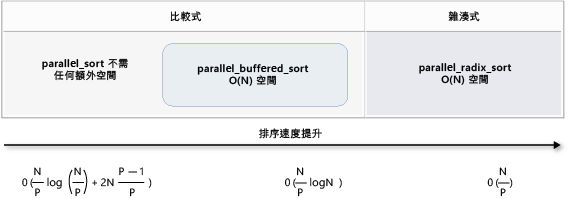

# <a name="parallel-algorithms"></a>平行演算法

平行模式程式庫（PPL）提供在資料集合上同時執行工作的演算法。 這些演算法與C++標準程式庫所提供的演算法相似。

平行演算法是由並行執行階段中的現有功能所組成。 例如， [concurrency：:p arallel_for](reference/concurrency-namespace-functions.md#parallel_for)演算法會使用[concurrency：： structured_task_group](../../parallel/concrt/reference/structured-task-group-class.md)物件來執行平行迴圈反覆運算。 `parallel_for`演算法資料分割會以最佳方式來運作，並提供可用的計算資源數目。

##  <a name="top"></a> 章節

- [Parallel_for 演算法](#parallel_for)

- [Parallel_for_each 演算法](#parallel_for_each)

- [Parallel_invoke 演算法](#parallel_invoke)

- [Parallel_transform 和 parallel_reduce 演算法](#parallel_transform_reduce)

    - [Parallel_transform 演算法](#parallel_transform)

    - [Parallel_reduce 演算法](#parallel_reduce)

    - [例如：以平行方式執行對應和縮減](#map_reduce_example)

- [分割工作](#partitions)

- [平行排序](#parallel_sorting)

    - [選擇排序演算法](#choose_sort)

##  <a name="parallel_for"></a>Parallel_for 演算法

[Concurrency：:p arallel_for](reference/concurrency-namespace-functions.md#parallel_for)演算法會重複地平行執行相同的工作。 這些工作都是以反復專案值來參數化。 當您的迴圈主體不會在該迴圈的反復專案之間共用資源時，此演算法會很有用。

演算法`parallel_for`會以最佳方式分割工作以進行平行執行。 當工作負載不平衡時，它會使用工作竊取演算法和範圍竊取來平衡這些資料分割。 當一個迴圈反復專案以合作方式封鎖時，執行時間會將指派給目前線程的反復專案範圍，轉散發到其他執行緒或處理器。 同樣地，當執行緒完成某個範圍的反復專案時，執行時間會將其他執行緒的工作轉散發至該執行緒。 演算法也支援嵌套的平行處理原則。 `parallel_for` 當一個平行迴圈包含另一個平行迴圈時，執行時間會以有效率的方式協調迴圈主體之間的處理資源，以進行平行執行。

此`parallel_for`演算法有數個多載版本。 第一個版本採用起始值、結束值和工作函式（lambda 運算式、函數物件或函式指標）。 第二個版本採用起始值、結束值、要逐步執行的值，以及工作函數。 此函式的第一個版本會使用1作為步驟值。 其餘的版本會採用「分割區」物件，可讓`parallel_for`您指定如何線上程之間分割範圍。 本檔的[分割工作](#partitions)一節中會更詳細地說明 partitioner。

您可以轉換許多`for`迴圈來使用`parallel_for`。 不過， `parallel_for`此演算法與`for`語句有下列不同之處：

- `parallel_for` 演算法`parallel_for`不會以預先決定的順序來執行工作。

- `parallel_for`演算法不支援任意終止條件。 當`parallel_for`反覆運算變數目前的值`last`小於時，此演算法就會停止。

- `_Index_type`型別參數必須是整數類資料型別。 這個整數型別可以是帶正負號或不帶正負號的。

- 迴圈反復專案必須是轉寄的。 如果參數小於1， 演算法就會擲回[std：：invalid_argument](../../standard-library/invalid-argument-class.md)類型的例外`parallel_for` `_Step`狀況。

- `parallel_for`演算法的例外狀況處理機制與`for`迴圈的不同。 如果平行迴圈主體同時發生多個例外狀況，執行時間只會將其中一個例外狀況傳播至呼叫`parallel_for`的執行緒。 此外，當一個迴圈反覆運算擲回例外狀況時，執行時間不會立即停止整體迴圈。 相反地，迴圈會放在已取消的狀態，而執行時間會捨棄尚未啟動的任何工作。 如需例外狀況處理和平行演算法的詳細資訊，請參閱[例外狀況處理](../../parallel/concrt/exception-handling-in-the-concurrency-runtime.md)。

雖然此`parallel_for`演算法不支援任意終止條件，但您可以使用取消來停止所有工作。 如需取消的詳細資訊，請參閱[PPL 中的取消](cancellation-in-the-ppl.md)。

> [!NOTE]
>  負載平衡和功能支援（例如取消）所產生的排程成本，可能無法克服平行執行迴圈主體的優點，特別是當迴圈主體相對較小時。 您可以使用平行迴圈中的「分割器」，將此額外負荷降到最低。 如需詳細資訊，請參閱本檔稍後的[分割區工作](#partitions)。

### <a name="example"></a>範例

下列範例顯示`parallel_for`演算法的基本結構。 這個範例會以平行方式，將範圍 [1，5] 中的每個值列印到主控台。

[!code-cpp[concrt-parallel-for-structure#1](../../parallel/concrt/codesnippet/cpp/parallel-algorithms_1.cpp)]

這個範例會產生下列範例輸出：

```Output
1 2 4 3 5
```

`parallel_for`因為演算法會平行處理每個專案，所以這些值列印到主控台的順序會有所不同。

如需使用`parallel_for`演算法的完整範例，請參閱[如何：撰寫 parallel_for 迴圈](../../parallel/concrt/how-to-write-a-parallel-for-loop.md)。

[[靠上](#top)]

##  <a name="parallel_for_each"></a>Parallel_for_each 演算法

[Concurrency：:p arallel_for_each](reference/concurrency-namespace-functions.md#parallel_for_each)演算法會在反復的容器上執行工作，例如C++標準程式庫所提供的平行處理。 它會使用`parallel_for`演算法所使用的相同分割邏輯。

演算法類似C++標準程式庫[std：： for_each](../../standard-library/algorithm-functions.md#for_each)演算法，不同之處在于`parallel_for_each`演算法會同時執行這些工作。 `parallel_for_each` 就像其他平行演算法`parallel_for_each`一樣，並不會依特定循序執行工作。

`parallel_for_each`雖然演算法適用于正向反覆運算器和隨機存取反覆運算器，但它的執行效果優於隨機存取反覆運算器。

### <a name="example"></a>範例

下列範例顯示`parallel_for_each`演算法的基本結構。 這個範例會以平行方式將[std：： array](../../standard-library/array-class-stl.md)物件中的每個值列印到主控台。

[!code-cpp[concrt-parallel-for-each-structure#1](../../parallel/concrt/codesnippet/cpp/parallel-algorithms_2.cpp)]

這個範例會產生下列範例輸出：

```Output
4 5 1 2 3
```

`parallel_for_each`因為演算法會平行處理每個專案，所以這些值列印到主控台的順序會有所不同。

如需使用`parallel_for_each`演算法的完整範例，請參閱[如何：撰寫 parallel_for_each 迴圈](../../parallel/concrt/how-to-write-a-parallel-for-each-loop.md)。

[[靠上](#top)]

##  <a name="parallel_invoke"></a>Parallel_invoke 演算法

[Concurrency：:p arallel_invoke](reference/concurrency-namespace-functions.md#parallel_invoke)演算法會平行執行一組工作。 在每個工作完成之前，它不會傳回。 當您有多個想要同時執行的獨立工作時，此演算法會很有用。

`parallel_invoke`演算法會採用一系列的工作函式（lambda 函式、函式物件或函式指標）做為其參數。 `parallel_invoke`演算法會多載以接受兩個到十個參數。 您傳遞給`parallel_invoke`的每個函式都必須接受零個參數。

就像其他平行演算法`parallel_invoke`一樣，並不會依特定循序執行工作。 「工作[平行](../../parallel/concrt/task-parallelism-concurrency-runtime.md)處理原則」主題`parallel_invoke`會說明演算法與工作和工作組的關聯性。

### <a name="example"></a>範例

下列範例顯示`parallel_invoke`演算法的基本結構。 這個範例會在三`twice`個區域變數上同時呼叫函式，並將結果列印至主控台。

[!code-cpp[concrt-parallel-invoke-structure#1](../../parallel/concrt/codesnippet/cpp/parallel-algorithms_3.cpp)]

這個範例會產生下列輸出：

```Output
108 11.2 HelloHello
```

如需使用`parallel_invoke`演算法的完整範例，請[參閱如何：使用 parallel_invoke 撰寫平行排序常式](../../parallel/concrt/how-to-use-parallel-invoke-to-write-a-parallel-sort-routine.md)和[如何：使用 parallel_invoke 執行平行作業](../../parallel/concrt/how-to-use-parallel-invoke-to-execute-parallel-operations.md)。

[[靠上](#top)]

##  <a name="parallel_transform_reduce"></a>Parallel_transform 和 parallel_reduce 演算法

[Concurrency：:p arallel_transform](reference/concurrency-namespace-functions.md#parallel_transform)和[concurrency：:p arallel_reduce](reference/concurrency-namespace-functions.md#parallel_reduce)演算法分別C++是標準程式庫演算法[std：： transform](../../standard-library/algorithm-functions.md#transform)和[std：：累加](../../standard-library/numeric-functions.md#accumulate)的平行版本。 並行執行階段版本的行為與C++標準程式庫版本相似，不同之處在于不會判斷作業順序，因為它們會以平行方式執行。 當您使用的集合夠大，可讓您以平行方式處理效能和擴充性優勢時，請使用這些演算法。

> [!IMPORTANT]
>  `parallel_transform` 和`parallel_reduce`演算法僅支援隨機存取、雙向和正向反覆運算器，因為這些反覆運算器會產生穩定的記憶體位址。 此外，這些反覆運算器必須產生非`const`左值。

###  <a name="parallel_transform"></a>Parallel_transform 演算法

您可以使用`parallel transform`演算法來執行許多資料平行處理作業。 例如，您可以：

- 調整影像的亮度，並執行其他影像處理作業。

- 加總或採用兩個向量之間的點積，並對向量執行其他數值計算。

- 執行3-d 光線追蹤，其中每個反復專案都會參考一個必須轉譯的圖元。

下列範例顯示用來呼叫`parallel_transform`演算法的基本結構。 這個範例會以兩種方式否定 std：：[vector](../../standard-library/vector-class.md)物件的每個元素。 第一種方式是使用 lambda 運算式。 第二種方式使用[std：：否定](../../standard-library/negate-struct.md)，其衍生自[std：： unary_function](../../standard-library/unary-function-struct.md)。

[!code-cpp[concrt-basic-parallel-transform#1](../../parallel/concrt/codesnippet/cpp/parallel-algorithms_4.cpp)]

> [!WARNING]
>  這個範例示範的基本用法`parallel_transform`。 由於工作函式不會執行大量的工作，因此在此範例中，不需要大幅增加效能。

此`parallel_transform`演算法有兩個多載。 第一個多載會採用一個輸入範圍和一元函數。 一元函式可以是採用一個引數、函式物件或衍生自之`unary_function`類型的 lambda 運算式。 第二個多載接受兩個輸入範圍和一個二元函數。 二元函式可以是接受兩個引數的 lambda 運算式、函式物件或衍生自[std：： binary_function](../../standard-library/binary-function-struct.md)的類型。 下列範例說明這些差異。

[!code-cpp[concrt-parallel-transform-vectors#2](../../parallel/concrt/codesnippet/cpp/parallel-algorithms_5.cpp)]

> [!IMPORTANT]
>  您為的輸出`parallel_transform`提供的反覆運算器必須完全重迭輸入反覆運算器，否則根本不會重迭。 如果輸入和輸出反覆運算器部分重迭，則不會指定此演算法的行為。

###  <a name="parallel_reduce"></a>Parallel_reduce 演算法

當`parallel_reduce`您有一系列滿足關聯屬性的作業時，演算法會很有用。 （此演算法不需要交換屬性。）以下是一些您可以使用`parallel_reduce`執行的作業：

- 將矩陣序列相乘以產生矩陣。

- 將向量乘以一系列矩陣以產生向量。

- 計算字串序列的長度。

- 將元素清單（例如字串）合併成一個元素。

下列基本範例示範如何使用`parallel_reduce`演算法，將一連串的字串結合成一個字串。 如同的範例`parallel_transform`，在此基本範例中，不需要效能提升。

[!code-cpp[concrt-basic-parallel-reduce#1](../../parallel/concrt/codesnippet/cpp/parallel-algorithms_6.cpp)]

在許多情況下，您可以`parallel_reduce`將視為使用`parallel_for_each`演算法的速記與[concurrency：：組合](../../parallel/concrt/reference/combinable-class.md)類別。

###  <a name="map_reduce_example"></a>實例以平行方式執行對應和縮減

*對應*作業會將函式套用至序列中的每個值。 「*減少*」作業會將序列的元素結合成一個值。 您可以使用C++標準程式庫[std：： transform](../../standard-library/algorithm-functions.md#transform)和[std：：累積](../../standard-library/numeric-functions.md#accumulate)函數來執行對應和縮減作業。 不過，對於許多問題，您可以使用`parallel_transform`演算法以平行方式執行對應作業`parallel_reduce` ，而演算法會平行執行「縮小」作業。

下列範例會比較以順序和平行方式計算質數總和所花費的時間。 [對應] 階段會將非質數值轉換為0，而 [縮減] 階段會加總這些值。

[!code-cpp[concrt-parallel-map-reduce-sum-of-primes#1](../../parallel/concrt/codesnippet/cpp/parallel-algorithms_7.cpp)]

如需以平行方式執行對應並減少作業的另一個範例[，請參閱如何：以平行](../../parallel/concrt/how-to-perform-map-and-reduce-operations-in-parallel.md)方式執行對應和縮減作業。

[[靠上](#top)]

##  <a name="partitions"></a>分割工作

若要在資料來源上平行處理作業，重要的步驟是將*來源分割成*多個區段，讓多個執行緒可以同時存取。 「分割區」（partition）會指定平行演算法應該如何分割線程之間的範圍。 如本檔先前所述，PPL 會使用預設的分割機制來建立初始工作負載，然後使用工作竊取演算法和範圍竊取，在工作負載不平衡時平衡這些分割區。 例如，當一個迴圈反覆運算完成某個範圍的反復專案時，執行時間會將其他執行緒的工作轉散發至該執行緒。 不過，在某些情況下，您可能會想要指定更適合您問題的不同分割機制。

、和演算法會提供採用額外參數`_Partitioner`的多載版本。 `parallel_transform` `parallel_for_each` `parallel_for` 這個參數會定義分割工作的分區類型。 以下是 PPL 定義的 partitioner 類型：

[concurrency::affinity_partitioner](../../parallel/concrt/reference/affinity-partitioner-class.md)<br/>
將工作分割成固定數目的範圍（通常是可在迴圈上運作的背景工作執行緒數目）。 此分割區類型`static_partitioner`類似，但會依將範圍對應至背景工作執行緒的方式來改善快取相似性。 當迴圈在相同的資料集上執行多次（例如迴圈內的迴圈），而且資料適用于快取時，此分割區類型可以改善效能。 此分割分區未完全參與取消。 它也不會使用合作式封鎖的語義，因此無法搭配具有向前相依性的平行迴圈使用。

[concurrency::auto_partitioner](../../parallel/concrt/reference/auto-partitioner-class.md)<br/>
將工作分成數個初始的範圍（通常是可在迴圈上運作的背景工作執行緒數目）。 當您未呼叫採用`_Partitioner`參數的多載平行演算法時，執行時間預設會使用此類型。 每個範圍都可以劃分成子範圍，因此可進行負載平衡。 當工作範圍完成時，執行時間會將工作的子範圍從其他執行緒轉散發到該執行緒。 如果您的工作負載不屬於其他類別，或您需要完整支援取消或合作式封鎖，請使用此分割程式。

[concurrency::simple_partitioner](../../parallel/concrt/reference/simple-partitioner-class.md)<br/>
將工作分割為範圍，讓每個範圍至少有指定之區塊大小所指定的反覆運算次數。 此分割程式類型會參與負載平衡;不過，執行時間不會將範圍分割成子範圍。 針對每個背景工作，執行時間會檢查取消，並在反覆運算`_Chunk_size`完成之後執行負載平衡。

[concurrency::static_partitioner](../../parallel/concrt/reference/static-partitioner-class.md)<br/>
將工作分割成固定數目的範圍（通常是可在迴圈上運作的背景工作執行緒數目）。 此分割器類型可以改善效能，因為它不會使用工作竊取，因此會有較少的額外負荷。 當平行迴圈的每個反覆項目執行的固定攄 擩鶲工作量，且您不需要支援取消或轉送合作式封鎖時，請使用這個 partitioner 型別。

> [!WARNING]
>  和演算法僅支援使用隨機存取反覆運算器（例如 std：：[vector](../../standard-library/vector-class.md)）進行靜態、簡單和親和性 partitioner 的容器。`parallel_for_each` `parallel_transform` 使用使用雙向和正向反覆運算器的容器會產生編譯時期錯誤。 預設`auto_partitioner`的「分割器」支援這三種 iterator 類型。

一般而言，這些 partitioner 會以相同的方式使用，但除外`affinity_partitioner`。 大部分的分割器類型都不會維護狀態，而且執行時間不會修改它。 因此，您可以在呼叫位置建立這些分區端物件，如下列範例所示。

[!code-cpp[concrt-static-partitioner#1](../../parallel/concrt/codesnippet/cpp/parallel-algorithms_8.cpp)]

不過，您必須以`affinity_partitioner` `const`非、左值參考的形式傳遞物件，讓演算法可以儲存狀態，供未來迴圈重複使用。 下列範例顯示的基本應用程式會平行執行相同的資料集作業多次。 使用`affinity_partitioner`可改善效能，因為陣列可能會納入快取中。

[!code-cpp[concrt-affinity-partitioner#1](../../parallel/concrt/codesnippet/cpp/parallel-algorithms_9.cpp)]

> [!CAUTION]
>  當您修改的現有程式碼依賴合作式封鎖語義來使用`static_partitioner`或`affinity_partitioner`時，請務必小心。 這些分割區類型不會使用負載平衡或範圍竊取，因此可以改變應用程式的行為。

判斷是否要在任何指定的案例中使用分割的最佳方式，就是試驗並測量在具代表性負載和電腦設定下，作業完成所需的時間。 例如，在只有幾個核心的多核心電腦上，靜態分割可能會帶來顯著的加速效果，但在有較多核心的電腦上，則可能拖慢速度。

[[靠上](#top)]

##  <a name="parallel_sorting"></a>平行排序

PPL 提供三種排序演算法： [concurrency：:p arallel_sort](reference/concurrency-namespace-functions.md#parallel_sort)、 [concurrency：:p arallel_buffered_sort](reference/concurrency-namespace-functions.md#parallel_buffered_sort)和[concurrency：:p arallel_radixsort](reference/concurrency-namespace-functions.md#parallel_radixsort)。 當您的資料集可受益于平行排序時，這些排序演算法會很有用。 特別是當您有大型資料集，或使用計算成本高昂的比較作業來排序資料時，平行排序非常有用。 這些演算法中的每個都會就地排序元素。

`parallel_sort` 和`parallel_buffered_sort`演算法都是以比較為基礎的演算法。 也就是說，它們會以傳值方式比較元素。 此`parallel_sort`演算法沒有額外的記憶體需求，適用于一般用途的排序。 演算法`parallel_buffered_sort`的執行`parallel_sort`效果優於，但需要 O （N）空間。

`parallel_radixsort`演算法是以雜湊為基礎。 也就是說，它會使用整數索引鍵來排序元素。 藉由使用索引鍵，此演算法可以直接計算元素的目的地，而不是使用比較。 就`parallel_buffered_sort`像一樣，此演算法需要 O （N）空間。

下表摘要說明三種平行排序演算法的重要屬性。

|演算法|描述|排序機制|排序穩定性|記憶體需求|時間複雜性|反覆運算器存取|
|---------------|-----------------|-----------------------|--------------------|-------------------------|---------------------|---------------------|
|`parallel_sort`|一般用途的比較式排序。|以比較為基礎（遞增）|得|無|O （（N/P） log （N/P） + 2N （（P-1）/P））|隨機|
|`parallel_buffered_sort`|較快速的一般用途比較式排序，需要 O （N）個空間。|以比較為基礎（遞增）|得|需要額外的 O （N）空間|O （（N/P） log （N））|隨機|
|`parallel_radixsort`|需要 O （N）空間的整數索引鍵型排序。|以雜湊為基礎|穩定|需要額外的 O （N）空間|O （N/P）|隨機|

下圖顯示三個平行排序演算法的重要屬性，更有圖形化。



這些平行排序演算法會遵循取消和例外狀況處理的規則。 如需並行執行階段中取消和例外狀況處理的詳細資訊，請參閱[取消平行演算法](../../parallel/concrt/cancellation-in-the-ppl.md#algorithms)和[例外狀況處理](../../parallel/concrt/exception-handling-in-the-concurrency-runtime.md)。

> [!TIP]
>  這些平行排序演算法支援 move 語義。 您可以定義移動指派運算子，讓交換作業更有效率地進行。 如需移動語義和移動指派運算子的詳細資訊，請參閱右值參考宣告子[： & &](../../cpp/rvalue-reference-declarator-amp-amp.md)，以及移動函式[和C++移動指派運算子（）](../../cpp/move-constructors-and-move-assignment-operators-cpp.md)。 如果您未提供移動指派運算子或交換函式，則排序演算法會使用複製的「處理」（copy）函數。

下列基本範例示範如何使用`parallel_sort`來`vector`排序值的`int` 。 根據預設， `parallel_sort`會使用[std：： less](../../standard-library/less-struct.md)來比較值。

[!code-cpp[concrt-basic-parallel-sort#1](../../parallel/concrt/codesnippet/cpp/parallel-algorithms_10.cpp)]

這個範例會示範如何提供自訂的比較函數。 它使用[std：： complex：： real](../../standard-library/complex-class.md#real)方法，以遞增順序排序[std：\<： complex double >](../../standard-library/complex-double.md)值。

[!code-cpp[concrt-basic-parallel-sort#2](../../parallel/concrt/codesnippet/cpp/parallel-algorithms_11.cpp)]

這個範例會示範如何將雜湊函式提供`parallel_radixsort`給演算法。 這個範例會將3-d 點排序。 這些點會根據其與參考點的距離進行排序。

[!code-cpp[concrt-parallel-sort-points#1](../../parallel/concrt/codesnippet/cpp/parallel-algorithms_12.cpp)]

例如，此範例會使用相對較小的資料集。 您可以增加向量的初始大小，以試驗較大型資料集的效能改進。

這個範例會使用 lambda 運算式做為雜湊函式。 您也可以使用 std：：[hash 類別](../../standard-library/hash-class.md)的其中一個內建實作為，或定義您自己的特製化。 您也可以使用自訂雜湊函數物件，如下列範例所示：

[!code-cpp[concrt-parallel-sort-points#2](../../parallel/concrt/codesnippet/cpp/parallel-algorithms_13.cpp)]

[!code-cpp[concrt-parallel-sort-points#3](../../parallel/concrt/codesnippet/cpp/parallel-algorithms_14.cpp)]

雜湊函數必須傳回整數類型（[std：： is_integral：： value](../../standard-library/is-integral-class.md)必須為**true**）。 這個整數型別必須可轉換成型`size_t`別。

###  <a name="choose_sort"></a>選擇排序演算法

在許多情況下`parallel_sort` ，會提供速度和記憶體效能的最佳平衡。 不過，當您增加資料集的大小時，可用的處理器數目或比較`parallel_buffered_sort`函式的複雜性，或`parallel_radixsort`可以執行得更好。 判斷任何特定案例所要使用之排序演算法的最佳方式，就是試驗並測量在代表電腦設定下排序一般資料所需的時間。 當您選擇排序策略時，請記住下列指導方針。

- 您的資料集大小。 在本檔中，*小型*資料集包含少於1000個元素、*中型*資料集包含10000與100000個元素，而*大型*資料集包含超過100000個元素。

- 您的 compare 函數或雜湊函式所執行的工作量。

- 可用計算資源的數量。

- 資料集的特性。 例如，如果資料已幾乎排序，而不是完全未排序的資料，則其中一個演算法可能會執行得很好。

- 區塊大小。 選擇性`_Chunk_size`的引數會指定當演算法將整體排序會細分為較小的工作單位時，何時從平行切換為序列排序執行。 例如，如果您提供512，當工作單位包含512或更少的元素時，演算法會切換為序列實作為。 序列執行可以改善整體效能，因為它可排除平行處理資料所需的額外負荷。

即使您有大量可用的運算資源，或比較函式或雜湊函式會執行相當大量的工作，也可能不值得以平行方式排序小型資料集。 您可以使用[std：： sort](../../standard-library/algorithm-functions.md#sort)函數來排序小型資料集。 （`parallel_sort`當您`sort`指定的區塊大小大於資料集時，就會`parallel_buffered_sort`呼叫，不過，必須配置 O （N）空間，因為鎖定爭用或記憶體配置可能需要額外的時間）。 `parallel_buffered_sort`

如果您必須節省記憶體，或您的記憶體配置器受到鎖定爭用的`parallel_sort`限制，請使用來排序中型資料集。 `parallel_sort`不需要額外的空間;其他演算法則需要 O （N）空間。

用`parallel_buffered_sort`來排序中型資料集，以及當您的應用程式符合額外的 O （N）空間需求時。 `parallel_buffered_sort`當您有大量的運算資源或昂貴的 compare 函數或雜湊函式時，可能會特別有用。

用`parallel_radixsort`來排序大型資料集，以及當您的應用程式符合額外的 O （N）空間需求時。 `parallel_radixsort`當對等比較作業較昂貴，或這兩項作業的成本很高時，可能會特別有用。

> [!CAUTION]
>  若要執行良好的雜湊函式，您必須知道資料集範圍，以及資料集中的每個元素如何轉換成對應的不帶正負號值。 因為雜湊運算適用于不帶正負號的值，所以如果無法產生未簽署的雜湊值，請考慮使用不同的排序策略。

下列範例會`sort`將、 `parallel_sort`、 `parallel_buffered_sort`和`parallel_radixsort`的效能與相同的大量亂數據進行比較。

[!code-cpp[concrt-choosing-parallel-sort#1](../../parallel/concrt/codesnippet/cpp/parallel-algorithms_15.cpp)]

在此範例中，假設在排序期間可接受配置 O （N）空間， `parallel_radixsort`在此電腦設定上執行此資料集的最佳做法。

[[靠上](#top)]

## <a name="related-topics"></a>相關主題

|標題|說明|
|-----------|-----------------|
|[如何：撰寫 parallel_for 迴圈](../../parallel/concrt/how-to-write-a-parallel-for-loop.md)|顯示如何使用`parallel_for`演算法來執行矩陣乘法。|
|[如何：撰寫 parallel_for_each 迴圈](../../parallel/concrt/how-to-write-a-parallel-for-each-loop.md)|顯示如何使用`parallel_for_each`演算法，以平行方式計算[std：： array](../../standard-library/array-class-stl.md)物件中的質數計數。|
|[如何：使用 parallel_invoke 撰寫平行排序常式](../../parallel/concrt/how-to-use-parallel-invoke-to-write-a-parallel-sort-routine.md)|顯示如何使用 `parallel_invoke` 演算法，以改善 bitonic 排序演算法的效能。|
|[如何：使用 parallel_invoke 執行平行作業](../../parallel/concrt/how-to-use-parallel-invoke-to-execute-parallel-operations.md)|顯示如何使用 `parallel_invoke` 演算法，以改善在共用資料來源上執行多個作業的程式效能。|
|[如何：平行執行對應和簡化運算](../../parallel/concrt/how-to-perform-map-and-reduce-operations-in-parallel.md)|示範如何使用`parallel_transform`和`parallel_reduce`演算法來執行對應，並減少計算檔案中文字出現次數的運算。|
|[平行模式程式庫 (PPL)](../../parallel/concrt/parallel-patterns-library-ppl.md)|說明 PPL，其提供命令式程式設計模型，可提升擴充性和方便使用，以開發並行應用程式。|
|[PPL 中的取消](cancellation-in-the-ppl.md)|說明 PPL 中取消的角色、如何取消平行工作，以及如何判斷取消工作組的時機。|
|[例外狀況處理](../../parallel/concrt/exception-handling-in-the-concurrency-runtime.md)|說明並行執行階段中例外狀況處理的角色。|

## <a name="reference"></a>參考資料

[parallel_for 函式](reference/concurrency-namespace-functions.md#parallel_for)

[parallel_for_each 函數](reference/concurrency-namespace-functions.md#parallel_for_each)

[parallel_invoke 函式](reference/concurrency-namespace-functions.md#parallel_invoke)

[affinity_partitioner 類別](../../parallel/concrt/reference/affinity-partitioner-class.md)

[auto_partitioner 類別](../../parallel/concrt/reference/auto-partitioner-class.md)

[simple_partitioner 類別](../../parallel/concrt/reference/simple-partitioner-class.md)

[static_partitioner 類別](../../parallel/concrt/reference/static-partitioner-class.md)

[parallel_sort 函式](reference/concurrency-namespace-functions.md#parallel_sort)

[parallel_buffered_sort 函式](reference/concurrency-namespace-functions.md#parallel_buffered_sort)

[parallel_radixsort 函式](reference/concurrency-namespace-functions.md#parallel_radixsort)
