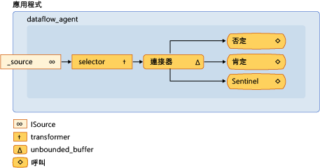

# <a name="walkthrough-creating-a-dataflow-agent"></a>逐步解說：建立資料流程代理程式

本文件將示範如何建立資料流程，而不是控制流程為基礎的代理程式型應用程式。

*控制流程*指的是在程式中的作業的執行順序。 控制流程是藉由使用控制結構，例如條件陳述式、 迴圈等等來調節。 或者，*資料流程*指的是程式設計模型，在其中計算會進行所有必要的資料時才可用。 資料流程程式設計模型被相關概念的訊息傳遞，在其中程式的獨立元件彼此所傳送訊息。

非同步代理程式同時支援控制流程與資料流程程式設計模型。 控制流程模型適合在許多情況下，雖然資料流程模型時，適用於其他類型，例如，代理程式接收資料，並執行的動作為基礎的資料承載。

## <a name="prerequisites"></a>必要條件

在開始本逐步解說之前，請閱讀下列文件：

- [非同步代理程式](../../parallel/concrt/asynchronous-agents.md)

- [非同步訊息區](../../parallel/concrt/asynchronous-message-blocks.md)

- [如何：使用訊息區篩選](../../parallel/concrt/how-to-use-a-message-block-filter.md)

##  <a name="top"></a> 章節

本逐步解說包含下列各節：

- [建立基本的控制流程的代理程式](#control-flow)

- [建立基本資料流程代理程式](#dataflow)

- [建立訊息記錄的代理程式](#logging)

##  <a name="control-flow"></a> 建立基本的控制流程的代理程式

請考慮下列範例定義`control_flow_agent`類別。 `control_flow_agent`類別會在三個訊息的緩衝區上： 其中一個輸入緩衝區和兩個輸出緩衝區。 `run`方法讀取來源的訊息緩衝區，在迴圈中，並會使用條件陳述式將導向控制程式執行流程。 代理程式會遞增一個計數器，非零的負數的值，並為非零的正整數值的另一個計數器遞增。 代理程式會收到零 sentinel 值之後，它會傳送至輸出訊息緩衝區的計數器值。 `negatives`和`positives`方法可讓應用程式從代理程式讀取負數和正數的值的計數。

[!code-cpp[concrt-dataflow-agent#1](../../parallel/concrt/codesnippet/cpp/walkthrough-creating-a-dataflow-agent_1.cpp)]

雖然這個範例會在代理程式的控制流程的基本用法，它會示範序列性質的控制流程為基礎的程式設計。 必須循序處理每則訊息，即使多個訊息可能出現在輸入的訊息的緩衝區。 資料流程模型可讓這兩個分支同時評估的條件陳述式。 資料流程模型也可讓您建立更複雜的傳訊網路，可供使用，對資料採取動作。

[[靠上](#top)]

##  <a name="dataflow"></a> 建立基本資料流程代理程式

本節說明如何將轉換`control_flow_agent`類別來使用資料流程模型來執行相同的工作。

資料流程代理程式的運作方式是建立的訊息緩衝區，其中每個特定用途的網路。 特定訊息區塊使用篩選函數來接受或拒絕訊息，以根據其內容。 篩選函數可確保該訊息區塊只接收特定值。

#### <a name="to-convert-the-control-flow-agent-to-a-dataflow-agent"></a>若要轉換的資料流程代理程式的流程控制代理程式

1. 複製主體`control_flow_agent`類別，以另一個類別，例如`dataflow_agent`。 或者，您可以重新命名`control_flow_agent`類別。

1. 移除呼叫迴圈的主體`receive`從`run`方法。

[!code-cpp[concrt-dataflow-agent#2](../../parallel/concrt/codesnippet/cpp/walkthrough-creating-a-dataflow-agent_2.cpp)]

1. 在`run`方法中，變數的初始化之後`negative_count`並`positive_count`，新增`countdown_event`追蹤作用中的作業數目的物件。

[!code-cpp[concrt-dataflow-agent#6](../../parallel/concrt/codesnippet/cpp/walkthrough-creating-a-dataflow-agent_3.cpp)]

   `countdown_event`類別會在本主題稍後所示。

1. 在資料流程網路中建立訊息將會參與的緩衝區物件。

[!code-cpp[concrt-dataflow-agent#3](../../parallel/concrt/codesnippet/cpp/walkthrough-creating-a-dataflow-agent_4.cpp)]

1. 連線的訊息緩衝區，以形成網路。

[!code-cpp[concrt-dataflow-agent#4](../../parallel/concrt/codesnippet/cpp/walkthrough-creating-a-dataflow-agent_5.cpp)]

1. 等候`event`和`countdown event`設定的物件。 這些事件發出訊號的代理程式已收到的 sentinel 值與所有作業都已都完成。

[!code-cpp[concrt-dataflow-agent#5](../../parallel/concrt/codesnippet/cpp/walkthrough-creating-a-dataflow-agent_6.cpp)]

下圖顯示完成的資料流程網路的`dataflow_agent`類別：



下表描述網路的成員。

|成員|描述|
|------------|-----------------|
|`increment_active`|A [concurrency:: transformer](../../parallel/concrt/reference/transformer-class.md)作用中事件計數器遞增，並將輸入的值傳遞給網路其餘部分的物件。|
|`negatives`、 `positives`|[concurrency:: call](../../parallel/concrt/reference/call-class.md)作用中事件計數器遞增的數字和遞減計數的物件。 每個物件會使用篩選來接受負數或正數。|
|`sentinel`|A [concurrency:: call](../../parallel/concrt/reference/call-class.md)作用中事件計數器接受只有零和遞減的 sentinel 值的物件。|
|`connector`|A [concurrency:: unbounded_buffer](reference/unbounded-buffer-class.md)連接到內部網路的來源訊息緩衝區的物件。|

因為`run`另一個執行緒上呼叫方法，其他執行緒可以將訊息傳送到網路之前完全連接的網路。 `_source`資料成員是`unbounded_buffer`緩衝處理會從代理程式的應用程式傳送的所有輸入的物件。 若要確定網路處理所有輸入的訊息，代理程式第一次連結網路的內部節點，然後連結該網路時，開頭`connector`至`_source`資料成員。 這樣可保證的訊息不可以處理，正在建立網路。

因為在此範例中的網路以資料流程為基礎，而非在控制流程，網路必須傳達給代理程式它已完成處理每個輸入的值和 sentinel 節點已收到其值。 這個範例會使用`countdown_event`來表示已處理所有輸入的值的物件和[concurrency:: event](../../parallel/concrt/reference/event-class.md)表示 sentinel 節點已收到其值的物件。 `countdown_event`類別會使用`event`計數器值達到零時發出訊號的物件。 資料流程網路的標頭會遞增的計數器，每當它收到的值。 每個終端節點的網路遞減計數器之後，它會處理輸入的值。 代理形成資料流程網路之後，它會等候 sentinel 節點，以設定`event`物件以及`countdown_event`物件來表示其計數器達到零。

下列範例所示`control_flow_agent`， `dataflow_agent`，和`countdown_event`類別。 `wmain`函式會建立`control_flow_agent`並`dataflow_agent`物件，並使用`send_values`函式以傳送至代理程式的一系列的隨機值。

[!code-cpp[concrt-dataflow-agent#7](../../parallel/concrt/codesnippet/cpp/walkthrough-creating-a-dataflow-agent_7.cpp)]

此範例會產生下列的範例輸出：

```Output
Control-flow agent:
There are 500523 negative numbers.
There are 499477 positive numbers.
Dataflow agent:
There are 500523 negative numbers.
There are 499477 positive numbers.
```

### <a name="compiling-the-code"></a>編譯程式碼

複製範例程式碼，並將它貼在 Visual Studio 專案中，或貼入名為的檔案中`dataflow-agent.cpp`，然後在 Visual Studio 命令提示字元 視窗中執行下列命令。

**cl.exe /EHsc 資料流程 agent.cpp**

[[靠上](#top)]

##  <a name="logging"></a> 建立訊息記錄的代理程式

下列範例所示`log_agent`類別，類似於`dataflow_agent`類別。 `log_agent`類別會實作非同步記錄代理程式，將記錄寫入訊息至檔案，與主控台。 `log_agent`類別可讓您的應用程式，將分類成參考用訊息的訊息、 警告或錯誤。 它也可讓應用程式指定是否要將每個記錄類別寫入至檔案、 主控台中，或兩者。 此範例會將所有檔案的記錄訊息和僅錯誤訊息寫入主控台。

[!code-cpp[concrt-log-filter#1](../../parallel/concrt/codesnippet/cpp/walkthrough-creating-a-dataflow-agent_8.cpp)]

此範例會將下列的輸出寫入主控台。

```Output
error: This is a sample error message.
```

此範例也會產生 log.txt 檔案，其中包含下列文字。

```Output
info: ===Logging started.===
warning: This is a sample warning message.
error: This is a sample error message.
info: ===Logging finished.===
```

### <a name="compiling-the-code"></a>編譯程式碼

複製範例程式碼，並將它貼在 Visual Studio 專案中，或貼入名為的檔案中`log-filter.cpp`，然後在 Visual Studio 命令提示字元 視窗中執行下列命令。

**cl.exe /EHsc 記錄 filter.cpp**

[[靠上](#top)]

## <a name="see-also"></a>另請參閱

[並行執行階段逐步解說](../../parallel/concrt/concurrency-runtime-walkthroughs.md)
