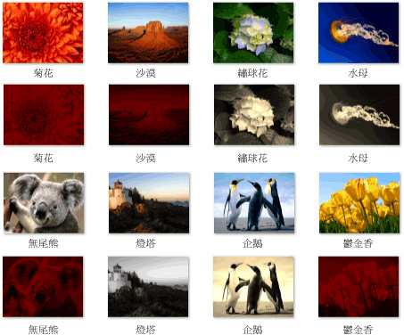

# 逐步解說：建立影像處理網路
[!INCLUDE[vs2017banner](../../assembler/inline/includes/vs2017banner.md)]

本文件示範如何建立可執行影像處理的非同步訊息區塊網路。  
  
 此網路決定根據影像特性，要在影像上執行哪些作業。  這個範例使用「*資料流程*」\(Dataflow\) 模型，透過網路來路由傳送影像。  在資料流程模型中，程式的獨立元件可藉由訊息傳送相互通訊。  當元件收到訊息時，它可以執行某項動作，然後將動作結果傳遞給另一個元件。  相較之下，「*控制流程*」\(Control Flow\) 模型中，應用程式使用控制結構，例如條件陳述式、迴圈等，來控制程式中的作業順序。  
  
 以資料流程為基礎的網路會建立工作「*管線*」\(Pipeline\)。  管線的每個階段都會並行執行整體工作的一部分。  以汽車製造的裝配線做比喻。  當每輛汽車通過裝配線時，某一站會組裝車架，另一站會安裝引擎，以此類推。  藉由同時組裝多輛汽車，裝配線比每次組裝一輛完整汽車提供更好的生產量。  
  
## 必要條件  
 在您開始閱讀此逐步解說前，請先參閱下列文件：  
  
-   [非同步訊息區](../../parallel/concrt/asynchronous-message-blocks.md)  
  
-   [如何：使用訊息區篩選條件](../../parallel/concrt/how-to-use-a-message-block-filter.md)  
  
-   [逐步解說：建立資料流程代理程式](../../parallel/concrt/walkthrough-creating-a-dataflow-agent.md)  
  
 我們也建議您在開始這個逐步解說之前，先了解 [!INCLUDE[ndptecgdiplus](../../parallel/concrt/includes/ndptecgdiplus_md.md)] 的基本概念。  如需 [!INCLUDE[ndptecgdiplus](../../parallel/concrt/includes/ndptecgdiplus_md.md)] 的詳細資訊，請參閱 [GDI\+](_gdiplus_GDI_start_cpp)。  
  
##   章節  
 此逐步解說包含下列章節：  
  
-   [定義影像處理功能](#functionality)  
  
-   [建立影像處理網路](#network)  
  
-   [完整的範例](#complete)  
  
##   定義影像處理功能  
 本節說明影像處理網路用來處理從磁碟讀取之影像的支援函式。  
  
 下列函式 `GetRGB` 和 `MakeColor` 分別會擷取及結合給定色彩的個別元件。  
  
 [!code-cpp[concrt-image-processing-filter#2](../../parallel/concrt/codesnippet/CPP/walkthrough-creating-an-image-processing-network_1.cpp)]  
  
 下列函式 `ProcessImage` 會呼叫給定的 [std::function](../../standard-library/function-class.md) 物件，以轉換 [!INCLUDE[ndptecgdiplus](../../parallel/concrt/includes/ndptecgdiplus_md.md)] [Bitmap](https://msdn.microsoft.com/en-us/library/ms534420.aspx) 物件中每個像素的色彩值。  `ProcessImage` 函式會使用 [concurrency::parallel\_for](../Topic/parallel_for%20Function.md) 演算法，平行處理點陣圖的每列。  
  
 [!code-cpp[concrt-image-processing-filter#3](../../parallel/concrt/codesnippet/CPP/walkthrough-creating-an-image-processing-network_2.cpp)]  
  
 下列函式 `Grayscale`、`Sepiatone`、`ColorMask` 和 `Darken` 會呼叫 `ProcessImage` 函式，以轉換 `Bitmap` 物件中每個像素的色彩值。  每個這些函式都會使用 Lambda 運算式，以定義一個像素的色彩轉換。  
  
 [!code-cpp[concrt-image-processing-filter#4](../../parallel/concrt/codesnippet/CPP/walkthrough-creating-an-image-processing-network_3.cpp)]  
  
 下列函式 `GetColorDominance` 也會呼叫 `ProcessImage` 函式。  不過，這個函式使用 [concurrency::combinable](../../parallel/concrt/reference/combinable-class.md) 物件，計算紅色、綠色或藍色元件為影像的主色，而不會變更每個色彩值。  
  
 [!code-cpp[concrt-image-processing-filter#5](../../parallel/concrt/codesnippet/CPP/walkthrough-creating-an-image-processing-network_4.cpp)]  
  
 下列函式 `GetEncoderClsid` 會擷取給定 MIME 編碼器類型的類別識別碼。  應用程式使用此函式以擷取點陣圖的編碼器。  
  
 [!code-cpp[concrt-image-processing-filter#6](../../parallel/concrt/codesnippet/CPP/walkthrough-creating-an-image-processing-network_5.cpp)]  
  
 \[[上方](#top)\]  
  
##   建立影像處理網路  
 本節說明如何建立非同步訊息區塊網路，在給定目錄的每個 [!INCLUDE[TLA#tla_jpeg](../../parallel/concrt/includes/tlasharptla_jpeg_md.md)] \(.jpg\) 影像上執行影像處理。  此網路會執行下列影像處理作業：  
  
1.  對於 Tom 撰寫的任何影像，轉換成灰階。  
  
2.  對於以紅色為主色的任何影像，移除綠色和藍色元件，然後暗化影像。  
  
3.  對於任何其他影像，套用復古色調。  
  
 網路只套用符合其中一個條件的第一個影像處理作業。  例如，如果影像是由 Tom 撰寫而且以紅色為其主色，此影像只會轉換成灰階。  
  
 在網路執行每個影像處理作業之後，它會在磁碟上將影像另存為點陣圖檔 \(.bmp\)。  
  
 下列步驟說明如何建立可實作此影像處理網路，並將該網路套用至給定目錄中每個 [!INCLUDE[TLA#tla_jpeg](../../parallel/concrt/includes/tlasharptla_jpeg_md.md)] 影像的函式。  
  
#### 若要建立影像處理網路  
  
1.  建立可接受磁碟上目錄名稱的 `ProcessImages` 函式。  
  
     [!code-cpp[concrt-image-processing-filter#7](../../parallel/concrt/codesnippet/CPP/walkthrough-creating-an-image-processing-network_6.cpp)]  
  
2.  在 `ProcessImages` 函式中，建立 `countdown_event` 變數。  本逐步解說稍後會說明 `countdown_event` 類別。  
  
     [!code-cpp[concrt-image-processing-filter#8](../../parallel/concrt/codesnippet/CPP/walkthrough-creating-an-image-processing-network_7.cpp)]  
  
3.  建立 [std::map](../../standard-library/map-class.md) 物件，它會將 `Bitmap` 物件與其原始檔案名稱產生關聯。  
  
     [!code-cpp[concrt-image-processing-filter#9](../../parallel/concrt/codesnippet/CPP/walkthrough-creating-an-image-processing-network_8.cpp)]  
  
4.  加入下列程式碼以定義影像處理網路的成員。  
  
     [!code-cpp[concrt-image-processing-filter#10](../../parallel/concrt/codesnippet/CPP/walkthrough-creating-an-image-processing-network_9.cpp)]  
  
5.  加入下列程式碼以連接網路。  
  
     [!code-cpp[concrt-image-processing-filter#11](../../parallel/concrt/codesnippet/CPP/walkthrough-creating-an-image-processing-network_10.cpp)]  
  
6.  加入下列程式碼，將目錄中每個 [!INCLUDE[TLA#tla_jpeg](../../parallel/concrt/includes/tlasharptla_jpeg_md.md)] 檔案的完整路徑傳送至網路前端。  
  
     [!code-cpp[concrt-image-processing-filter#12](../../parallel/concrt/codesnippet/CPP/walkthrough-creating-an-image-processing-network_11.cpp)]  
  
7.  等候 `countdown_event` 變數達到零。  
  
     [!code-cpp[concrt-image-processing-filter#13](../../parallel/concrt/codesnippet/CPP/walkthrough-creating-an-image-processing-network_12.cpp)]  
  
 下表說明網路成員。  
  
|成員|說明|  
|--------|--------|  
|`load_bitmap`|[concurrency::transformer](../../parallel/concrt/reference/transformer-class.md) 物件，會從磁碟載入 `Bitmap` 物件，並將項目加入至 `map` 物件，以將影像與其原始檔案名稱產生關聯。|  
|`loaded_bitmaps`|[concurrency::unbounded\_buffer](../Topic/unbounded_buffer%20Class.md) 物件，會將載入的影像傳送至影像處理篩選條件。|  
|`grayscale`|`transformer` 物件，會將 Tom 撰寫的影像轉換成灰階。  它使用影像的中繼資料，以判斷其作者。|  
|`colormask`|`transformer` 物件，會從以紅色為主色的影像中移除綠色和藍色元件。|  
|`darken`|`transformer` 物件，會暗化以紅色為主色的影像。|  
|`sepiatone`|`transformer` 物件，會將復古色調套用至不是由 Tom 撰寫也不是以紅色為主色的影像。|  
|`save_bitmap`|`transformer` 物件，會在磁碟上將處理過的 `image` 另存為點陣圖。  `save_bitmap` 會從 `map` 物件擷取原始檔案名稱，並將其副檔名變更為 .bmp。|  
|`delete_bitmap`|`transformer` 物件，會釋放影像的記憶體。|  
|`decrement`|[concurrency::call](../../parallel/concrt/reference/call-class.md) 物件，當做網路中的終端節點。  它會遞減 `countdown_event` 物件，對主應用程式表示已處理影像。|  
  
 `loaded_bitmaps` 訊息緩衝區很重要，因為做為 `unbounded_buffer` 物件，它會將 `Bitmap` 物件提供給多個接收者。  當目標區塊接受 `Bitmap` 物件時，`unbounded_buffer` 物件不會將該 `Bitmap` 物件提供給任何其他目標。  因此，您將物件連結至 `unbounded_buffer` 物件的順序很重要。  每個 `grayscale`、`colormask` 和 `sepiatone` 訊息區塊都會使用篩選條件，只接受特定的 `Bitmap` 物件。  `decrement` 訊息緩衝區是 `loaded_bitmaps` 訊息緩衝區的重要目標，因為它接受被其他訊息緩衝區拒絕的所有 `Bitmap` 物件。  需要有 `unbounded_buffer` 物件依序傳播訊息。  因此，`unbounded_buffer` 物件會封鎖直到新目標區塊連結至它本身，而且如果目前沒有接受訊息的目標區塊則會接受該訊息。  
  
 如果您的應用程式需要多個訊息區塊處理訊息，而不是只有第一個接受訊息的一個訊息區塊，則可以使用另一個訊息區塊類型，例如 `overwrite_buffer`。  `overwrite_buffer` 類別每次保存一則訊息，但會將該訊息傳播至其每一個目標。  
  
 下圖顯示影像處理網路：  
  
   
  
 這個範例中的 `countdown_event` 物件可讓影像處理網路在已處理所有影像時通知主應用程式。  `countdown_event` 類別使用 [concurrency::event](../../parallel/concrt/reference/event-class.md) 物件，在計數器值達到零時發出訊號。  每次主應用程式將檔案名稱傳送至網路時，它會遞增計數器。  已處理每個影像之後，網路的終端節點會遞減計數器。  在主應用程式周遊指定的目錄之後，它會等候 `countdown_event` 物件表示其計數器已達到零。  
  
 下列範例會示範 `countdown_event` 類別：  
  
 [!code-cpp[concrt-image-processing-filter#14](../../parallel/concrt/codesnippet/CPP/walkthrough-creating-an-image-processing-network_13.cpp)]  
  
 \[[上方](#top)\]  
  
##   完整的範例  
 下列程式碼顯示完整範例。  `wmain` 函式管理 [!INCLUDE[ndptecgdiplus](../../parallel/concrt/includes/ndptecgdiplus_md.md)] 程式庫並呼叫 `ProcessImages` 函式，以處理 `Sample Pictures` 目錄中的 [!INCLUDE[TLA#tla_jpeg](../../parallel/concrt/includes/tlasharptla_jpeg_md.md)] 檔案。  
  
 [!code-cpp[concrt-image-processing-filter#15](../../parallel/concrt/codesnippet/CPP/walkthrough-creating-an-image-processing-network_14.cpp)]  
  
 下圖顯示範例輸出。  每個來源影像在其修改過的對應影像之上。  
  
   
  
 `Lighthouse` 是由 Tom Alphin 撰寫，因此會轉換成灰階。  `Chrysanthemum`、`Desert`、`Koala` 和 `Tulips` 以紅色為主色，因此會移除藍色和綠色元件並暗化。  `Hydrangeas`、`Jellyfish` 和 `Penguins` 符合預設準則，因此會套用復古色調。  
  
 \[[上方](#top)\]  
  
### 編譯程式碼  
 請複製範例程式碼，並將它貼在 Visual Studio 專案中，或貼在名為 `image-processing-network.cpp` 的檔案中，然後在 Visual Studio 命令提示字元視窗中執行下列命令。  
  
 **cl.exe \/DUNICODE \/EHsc image\-processing\-network.cpp \/link gdiplus.lib**  
  
## 請參閱  
 [並行執行階段逐步解說](../../parallel/concrt/concurrency-runtime-walkthroughs.md)