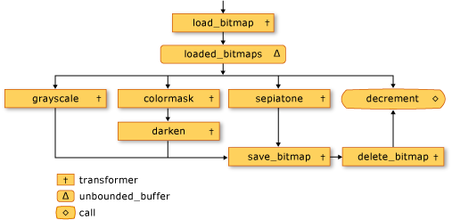

# 逐步解說：建立影像處理網路
本文件將示範如何建立執行映像處理的非同步訊息區的網路。  
  
 網路判斷要以其特性為基礎的映像上執行哪些作業。 這個範例會使用*資料流程*模型透過網路路由映像。 在資料流程模型中，程式的獨立元件會透過傳送訊息，彼此進行通訊。 當元件收到訊息時，它可以執行某些動作，然後將該動作的結果傳遞至另一個元件。 比較這*控制流程*模型，其中應用程式會使用控制結構，例如、 條件陳述式、 迴圈等等，來控制在程式中的作業的順序。  
  
 以資料流程為基礎的網路會建立*管線*的工作。 管線各階段同時執行整體工作的一部分。 以汽車製造的裝配線做比喻。 當每輛汽車通過裝配線時，站台會組譯的框架，另一個安裝引擎，依此類推。 藉由啟用來同時組裝多輛車，組件列會提供更佳的輸送量比組裝完成的生產量一一次。  
  
## 必要條件  
 在開始本逐步解說之前，請閱讀下列文件：  
  
-   [非同步訊息區](../../parallel/concrt/asynchronous-message-blocks.md)  
  
-   [如何：使用訊息區篩選條件](../../parallel/concrt/how-to-use-a-message-block-filter.md)  
  
-   [逐步解說：建立資料流程代理程式](../../parallel/concrt/walkthrough-creating-a-dataflow-agent.md)  
  
 我們也建議您在開始本逐步解說之前，了解的 GDI + 基本概念。  
  
##   章節  
 本逐步解說包含下列各節：  
  
-   [定義映像處理功能](#functionality)  
  
-   [建立影像處理網路](#network)  
  
-   [完整範例](#complete)  
  
##   定義映像處理功能  
 此區段會顯示映像處理網路用來處理從磁碟讀取的映像的支援函數。  
  
 下列函式中，`GetRGB`和`MakeColor`、 擷取和分別結合指定的色彩，個別元件。  
  
 [!code-cpp[concrt-image-processing-filter#2](../../parallel/concrt/codesnippet/cpp/walkthrough-creating-an-image-processing-network_1.cpp)]  
  

 下列函式中， `ProcessImage`，呼叫給定[std:: function](../../standard-library/function-class.md)物件轉換為 GDI + 中的每個像素的色彩值[點陣圖](/windows/desktop/api/gdiplusheaders/nl-gdiplusheaders-bitmap)物件。 `ProcessImage`函式會使用[concurrency:: parallel_for](reference/concurrency-namespace-functions.md#parallel_for)演算法處理以平行方式在點陣圖的每個資料列。  

  
 [!code-cpp[concrt-image-processing-filter#3](../../parallel/concrt/codesnippet/cpp/walkthrough-creating-an-image-processing-network_2.cpp)]  
  
 下列函式中， `Grayscale`， `Sepiatone`， `ColorMask`，以及`Darken`，呼叫`ProcessImage`函式，轉換中的每個像素的色彩值`Bitmap`物件。 所有這些函式會使用 lambda 運算式來定義一個像素的色彩轉換。  
  
 [!code-cpp[concrt-image-processing-filter#4](../../parallel/concrt/codesnippet/cpp/walkthrough-creating-an-image-processing-network_3.cpp)]  
  
 下列函式中， `GetColorDominance`，也會呼叫`ProcessImage`函式。 不過，而不是變更每個色彩值，這個函式會使用[concurrency:: combinable](../../parallel/concrt/reference/combinable-class.md)物件計算紅色、 綠色或藍色色彩元件是否為影像。  
  
 [!code-cpp[concrt-image-processing-filter#5](../../parallel/concrt/codesnippet/cpp/walkthrough-creating-an-image-processing-network_4.cpp)]  
  
 下列函式， `GetEncoderClsid`，擷取指定的 MIME 類型的編碼器的類別識別項。 應用程式會使用此函式來擷取點陣圖編碼器。  
  
 [!code-cpp[concrt-image-processing-filter#6](../../parallel/concrt/codesnippet/cpp/walkthrough-creating-an-image-processing-network_5.cpp)]  
  
 [[靠上](#top)]  
  
##   建立影像處理網路  
 本節說明如何建立在指定的目錄中的每個 JPEG (.jpg) 映像執行映像處理的非同步訊息區的網路。 網路會執行下列映像處理作業：  
  
1.  作者 Tom 任何映像，將轉換為灰階。  
  
2.  針對任何已做的主要色彩為紅色的映像，移除綠色和藍色元件，並接著暗化。  
  
3.  針對任何其他映像，適用於深褐色 toning。  
  
 網路只有第一個映像處理作業套用符合這些條件的其中一個。 比方說，如果影像作者 Tom，並具有為其主要色彩的紅色，映像只會轉換為灰階。  
  
 網路執行每個映像處理作業之後，它將影像儲存至磁碟為點陣圖 (.bmp) 檔案。  
  
 下列步驟示範如何建立會實作此映像處理網路，並將該網路套用至指定的目錄中每個 JPEG 影像的函式。  
  
#### 若要建立影像處理網路  
  
1.  建立函式， `ProcessImages`，會在磁碟上的目錄名稱。  
  
     [!code-cpp[concrt-image-processing-filter#7](../../parallel/concrt/codesnippet/cpp/walkthrough-creating-an-image-processing-network_6.cpp)]  
  
2.  在 `ProcessImages`函式中，建立`countdown_event`變數。 `countdown_event`類別會顯示稍後在本逐步解說。  
  
     [!code-cpp[concrt-image-processing-filter#8](../../parallel/concrt/codesnippet/cpp/walkthrough-creating-an-image-processing-network_7.cpp)]  
  
3.  建立[std:: map](../../standard-library/map-class.md)產生關聯的物件`Bitmap`以其原始的檔案名稱的物件。  
  
     [!code-cpp[concrt-image-processing-filter#9](../../parallel/concrt/codesnippet/cpp/walkthrough-creating-an-image-processing-network_8.cpp)]  
  
4.  新增下列程式碼來定義映像處理網路的成員。  
  
     [!code-cpp[concrt-image-processing-filter#10](../../parallel/concrt/codesnippet/cpp/walkthrough-creating-an-image-processing-network_9.cpp)]  
  
5.  加入下列程式碼，將網路連線。  
  
     [!code-cpp[concrt-image-processing-filter#11](../../parallel/concrt/codesnippet/cpp/walkthrough-creating-an-image-processing-network_10.cpp)]  
  
6.  加入下列程式碼，傳送至網路的標頭的每個 JPEG 檔案的完整路徑的目錄中。  
  
     [!code-cpp[concrt-image-processing-filter#12](../../parallel/concrt/codesnippet/cpp/walkthrough-creating-an-image-processing-network_11.cpp)]  
  
7.  等候`countdown_event`變數，以達到零。  
  
     [!code-cpp[concrt-image-processing-filter#13](../../parallel/concrt/codesnippet/cpp/walkthrough-creating-an-image-processing-network_12.cpp)]  
  
 下表描述網路的成員。  
  
|成員|描述|  
|------------|-----------------|  
|`load_bitmap`|A [concurrency:: transformer](../../parallel/concrt/reference/transformer-class.md)載入的物件`Bitmap`從磁碟物件，並加入至項目的`map`與其原始檔案名稱相關聯的映像的物件。|  
|`loaded_bitmaps`|A [concurrency:: unbounded_buffer](reference/unbounded-buffer-class.md)將載入的影像傳送至影像處理篩選條件的物件。|  
|`grayscale`|A`transformer`將轉換為灰階作者 Tom 的映像的物件。 它會使用映像的中繼資料來判斷其作者。|  
|`colormask`|A`transformer`移除有紅色的主要色彩與影像中的綠色和藍色色彩元件的物件。|  
|`darken`|A`transformer`有紅色的主要色彩與影像會變暗的物件。|  
|`sepiatone`|A`transformer`適用於深褐色 toning 映像不作者 Tom、 而不是以紅色的物件。|  
|`save_bitmap`|A`transformer`儲存已處理的物件`image`為點陣圖的磁碟。 `save_bitmap` 擷取原始的檔案名稱，從`map`物件，並變更.bmp 檔案的副檔名。|  
|`delete_bitmap`|A`transformer`釋放的記憶體供映像的物件。|  
|`decrement`|A [concurrency:: call](../../parallel/concrt/reference/call-class.md)物件，做為網路中的終端節點。 它遞減`countdown_event`來通知主應用程式映像已處理的物件。|  
  
 `loaded_bitmaps`訊息緩衝區是很重要，因為作為`unbounded_buffer`物件，它提供`Bitmap`物件到多個接收者。 當目標區塊接受`Bitmap`物件，`unbounded_buffer`物件並不提供，`Bitmap`任何其他目標的物件。 因此，您連結的順序物件至`unbounded_buffer`物件相當重要。 `grayscale`， `colormask`，並`sepiatone`每個區塊中使用篩選來接受訊息只有某些`Bitmap`物件。 `decrement`訊息緩衝區是很重要的目標`loaded_bitmaps`訊息緩衝區，因為它會接受所有`Bitmap`會拒絕其他的訊息緩衝區的物件。 `unbounded_buffer`物件，才能傳播訊息順序。 因此，`unbounded_buffer`物件封鎖，直到新的目標區塊會連結到它，並接受訊息，如果沒有目前的目標區塊接受該訊息。  
  
 如果您的應用程式需要訊息的多個封鎖處理序的訊息，而不是只是一則訊息區塊的第一次接受訊息，您可以使用其他訊息區塊類型，例如`overwrite_buffer`。 `overwrite_buffer`類別包含一則訊息一次，但它會傳播至其目標的每個訊息。  
  
 下圖顯示映像處理網路：  
  
   
  
 `countdown_event`在此範例中的物件可讓已處理的所有映像時，通知主應用程式的映像處理網路。 `countdown_event`類別會使用[concurrency:: event](../../parallel/concrt/reference/event-class.md)計數器值達到零時發出訊號的物件。 每次它傳送至網路的檔案名稱，主應用程式就會遞增計數器。 終端節點之網路遞減計數器在處理每個映像之後。 主要的應用程式會周遊指定的目錄之後，它會等候`countdown_event`物件來表示其計數器達到零。  
  
 下列範例所示`countdown_event`類別：  
  
 [!code-cpp[concrt-image-processing-filter#14](../../parallel/concrt/codesnippet/cpp/walkthrough-creating-an-image-processing-network_13.cpp)]  
  
 [[靠上](#top)]  
  
##   完整的範例  
 下列程式碼顯示完整範例。 `wmain`函式可管理的 GDI + 程式庫並呼叫`ProcessImages`中的函式來處理 JPEG 檔案`Sample Pictures`目錄。  
  
 [!code-cpp[concrt-image-processing-filter#15](../../parallel/concrt/codesnippet/cpp/walkthrough-creating-an-image-processing-network_14.cpp)]  
  
 下圖顯示範例輸出。 每個來源映像會高於其相對應修改的映像。  
  
   
  
 `Lighthouse` Tom Alphin 所撰寫，並因此會轉換為灰階。 `Chrysanthemum``Desert`， `Koala`，和`Tulips`已做的主要色彩的紅色因此已移除的藍色與綠色的色彩元件，而且會變黑。 `Hydrangeas``Jellyfish`，和`Penguins`符合預設準則，因此 深褐色 toned。  
  
 [[靠上](#top)]  
  
### 編譯程式碼  
 複製範例程式碼，並將它貼在 Visual Studio 專案中，或貼入名為的檔案中`image-processing-network.cpp`，然後在 Visual Studio 命令提示字元 視窗中執行下列命令。  
  
 **cl.exe /DUNICODE /EHsc 映像-處理-network.cpp /link gdiplus.lib**  
  
## 另請參閱  
 [並行執行階段逐步解說](../../parallel/concrt/concurrency-runtime-walkthroughs.md)
